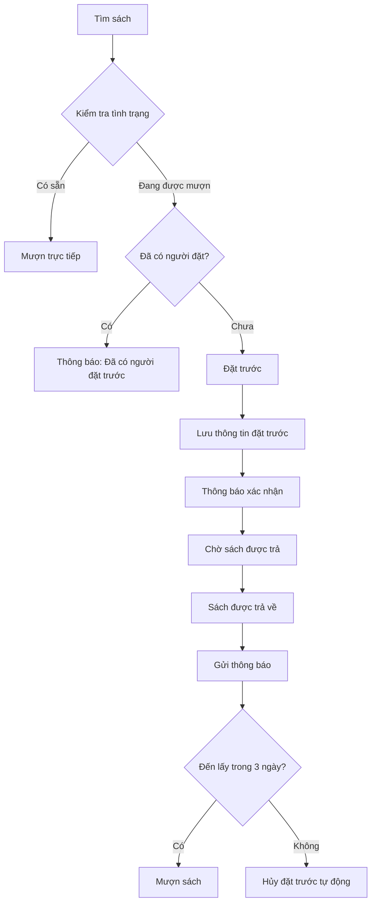

# Đặt trước sách

## Tổng quan

Cho phép độc giả đặt trước sách đang được mượn. Khi sách được trả, hệ thống tự động thông báo cho người đặt trước.

## Quy định đặt trước

- **Chỉ 1 người** được đặt trước cho mỗi sách
- **Giữ chỗ 3 ngày** kể từ khi sách có sẵn
- Sau 3 ngày không đến lấy → Hủy tự động
- Không thể đặt trước sách đang có sẵn

## Quy trình đặt trước



## Chức năng chính

### 1. Đặt trước sách

```typescript
interface Reservation {
  id: string;
  bookId: string;
  readerId: string;
  reservationDate: Date;
  status: 'waiting' | 'available' | 'fulfilled' | 'cancelled' | 'expired';
  notifiedDate?: Date;
  expiryDate?: Date;
  createdAt: Date;
}

async function createReservation(bookId: string, readerId: string) {
  // Kiểm tra sách đang được mượn
  const isAvailable = await checkBookAvailability(bookId);
  if (isAvailable) {
    throw new Error('Sách đang có sẵn, vui lòng mượn trực tiếp');
  }
  
  // Kiểm tra đã có người đặt trước chưa
  const existingReservation = await findActiveReservation(bookId);
  if (existingReservation) {
    throw new Error('Sách đã có người đặt trước');
  }
  
  // Kiểm tra người dùng đã đặt trước sách này chưa
  const userReservation = await findUserReservation(bookId, readerId);
  if (userReservation) {
    throw new Error('Bạn đã đặt trước sách này rồi');
  }
  
  // Tạo đặt trước
  const reservation = await db.reservations.create({
    data: {
      bookId,
      readerId,
      reservationDate: new Date(),
      status: 'waiting',
    },
  });
  
  return reservation;
}
```

### 2. Thông báo khi sách có sẵn

```typescript
async function notifyReservation(bookId: string) {
  // Tìm đặt trước đang chờ
  const reservation = await db.reservations.findFirst({
    where: {
      bookId,
      status: 'waiting',
    },
    include: {
      reader: true,
      book: true,
    },
  });
  
  if (!reservation) {
    return; // Không có ai đặt trước
  }
  
  // Cập nhật trạng thái
  const expiryDate = new Date();
  expiryDate.setDate(expiryDate.getDate() + 3); // Giữ chỗ 3 ngày
  
  await db.reservations.update({
    where: { id: reservation.id },
    data: {
      status: 'available',
      notifiedDate: new Date(),
      expiryDate,
    },
  });
  
  // Gửi thông báo trong app
  await createNotification({
    userId: reservation.readerId,
    type: 'reservation_available',
    title: 'Sách đã có sẵn',
    message: `Sách "${reservation.book.title}" đã có sẵn. Vui lòng đến lấy trước ${formatDate(expiryDate)}.`,
  });
  
  // Gửi email (nếu có)
  if (reservation.reader.email) {
    await sendEmail({
      to: reservation.reader.email,
      subject: 'Sách đặt trước đã có sẵn',
      body: `Xin chào ${reservation.reader.fullName},\n\nSách "${reservation.book.title}" mà bạn đặt trước đã có sẵn.\nVui lòng đến thư viện để mượn trước ${formatDate(expiryDate)}.\n\nTrân trọng,\nThư viện`,
    });
  }
}
```

### 3. Hủy đặt trước tự động

```typescript
// Chạy định kỳ mỗi ngày
async function expireReservations() {
  const now = new Date();
  
  // Tìm các đặt trước đã hết hạn
  const expiredReservations = await db.reservations.findMany({
    where: {
      status: 'available',
      expiryDate: {
        lt: now,
      },
    },
  });
  
  // Hủy các đặt trước hết hạn
  for (const reservation of expiredReservations) {
    await db.reservations.update({
      where: { id: reservation.id },
      data: { status: 'expired' },
    });
    
    // Thông báo
    await createNotification({
      userId: reservation.readerId,
      type: 'reservation_expired',
      title: 'Đặt trước đã hết hạn',
      message: `Đặt trước sách "${reservation.book.title}" đã hết hạn do bạn không đến lấy.`,
    });
  }
}
```

### 4. Hoàn thành đặt trước

```typescript
async function fulfillReservation(reservationId: string, borrowingId: string) {
  await db.reservations.update({
    where: { id: reservationId },
    data: {
      status: 'fulfilled',
      fulfilledDate: new Date(),
      borrowingId,
    },
  });
}
```

### 5. Hủy đặt trước thủ công

```typescript
async function cancelReservation(reservationId: string, reason?: string) {
  await db.reservations.update({
    where: { id: reservationId },
    data: {
      status: 'cancelled',
      cancelledDate: new Date(),
      cancelReason: reason,
    },
  });
}
```

## Giao diện

### Đặt trước từ chi tiết sách

```
┌─────────────────────────────────────────────────────────────┐
│ Chi tiết sách                                                │
├─────────────────────────────────────────────────────────────┤
│ [Ảnh bìa]  Toán học 7                                       │
│            Tác giả: Nguyễn Văn A                            │
│            NXB: Giáo dục                                     │
│            Năm XB: 2024                                      │
│                                                              │
│ Tình trạng: Đang được mượn                                  │
│ Dự kiến trả: 15/05/2026                                     │
│                                                              │
│ ⚠️ Đã có 1 người đặt trước                                  │
│                                                              │
│            [Đặt trước] (disabled)                           │
└─────────────────────────────────────────────────────────────┘
```

### Danh sách đặt trước của tôi

```
┌─────────────────────────────────────────────────────────────┐
│ Sách đã đặt trước                                           │
├─────────────────────────────────────────────────────────────┤
│ ┌──────────────────────────────────────────────────────┐   │
│ │ Toán học 7                                           │   │
│ │ Trạng thái: Đang chờ                                 │   │
│ │ Ngày đặt: 01/05/2026                                 │   │
│ │ Dự kiến có sẵn: 15/05/2026                          │   │
│ │                                        [Hủy đặt]     │   │
│ └──────────────────────────────────────────────────────┘   │
│                                                              │
│ ┌──────────────────────────────────────────────────────┐   │
│ │ Văn học 7                                            │   │
│ │ Trạng thái: Đã có sẵn ✓                             │   │
│ │ Vui lòng đến lấy trước: 10/05/2026                  │   │
│ │                                        [Xem chi tiết]│   │
│ └──────────────────────────────────────────────────────┘   │
└─────────────────────────────────────────────────────────────┘
```

### Quản lý đặt trước (Thủ thư)

```
┌─────────────────────────────────────────────────────────────┐
│ Quản lý đặt trước                                           │
├─────────────────────────────────────────────────────────────┤
│ Trạng thái: [Tất cả ▼]  Tìm kiếm: [___________]            │
├──────────────┬──────────────┬──────────┬──────────┬────────┤
│ Sách         │ Người đặt    │ Ngày đặt │ Trạng    │ Thao   │
│              │              │          │ thái     │ tác    │
├──────────────┼──────────────┼──────────┼──────────┼────────┤
│ Toán học 7   │ Nguyễn Văn A │ 01/05/26 │ Đang chờ │ [...]  │
│ Văn học 7    │ Trần Thị B   │ 03/05/26 │ Có sẵn   │ [...]  │
│ Lịch sử 7    │ Lê Văn C     │ 28/04/26 │ Hết hạn  │ [...]  │
└──────────────┴──────────────┴──────────┴──────────┴────────┘
```

## Database Schema

```sql
CREATE TABLE reservations (
  id TEXT PRIMARY KEY,
  book_id TEXT NOT NULL,
  reader_id TEXT NOT NULL,
  reservation_date DATETIME NOT NULL,
  status TEXT NOT NULL CHECK(status IN ('waiting', 'available', 'fulfilled', 'cancelled', 'expired')),
  notified_date DATETIME,
  expiry_date DATETIME,
  fulfilled_date DATETIME,
  borrowing_id TEXT,
  cancelled_date DATETIME,
  cancel_reason TEXT,
  created_at DATETIME DEFAULT CURRENT_TIMESTAMP,
  updated_at DATETIME DEFAULT CURRENT_TIMESTAMP,
  FOREIGN KEY (book_id) REFERENCES books(id),
  FOREIGN KEY (reader_id) REFERENCES readers(id),
  FOREIGN KEY (borrowing_id) REFERENCES borrowings(id)
);

-- Index
CREATE INDEX idx_reservations_book_status ON reservations(book_id, status);
CREATE INDEX idx_reservations_reader ON reservations(reader_id);
CREATE INDEX idx_reservations_expiry ON reservations(expiry_date) WHERE status = 'available';
```

## Thống kê

### Báo cáo đặt trước

- Số lượng đặt trước đang chờ
- Số lượng đặt trước đã hoàn thành
- Số lượng đặt trước hết hạn
- Top sách được đặt trước nhiều nhất
- Thời gian chờ trung bình

## Quyền hạn

| Thao tác | Admin | Thủ thư | Giáo viên | Học sinh |
|----------|-------|---------|-----------|----------|
| Đặt trước | ✓ | ✓ | ✓ | ✓ |
| Xem đặt trước của mình | ✓ | ✓ | ✓ | ✓ |
| Hủy đặt trước của mình | ✓ | ✓ | ✓ | ✓ |
| Xem tất cả đặt trước | ✓ | ✓ | ✗ | ✗ |
| Hủy đặt trước của người khác | ✓ | ✓ | ✗ | ✗ |

## Tài liệu liên quan

- [Mượn/Trả sách](./muon-tra-sach.md)
- [Thông báo](./thong-bao.md)
- [Quy định nghiệp vụ](../tong-quan/quy-dinh-nghiep-vu.md)
