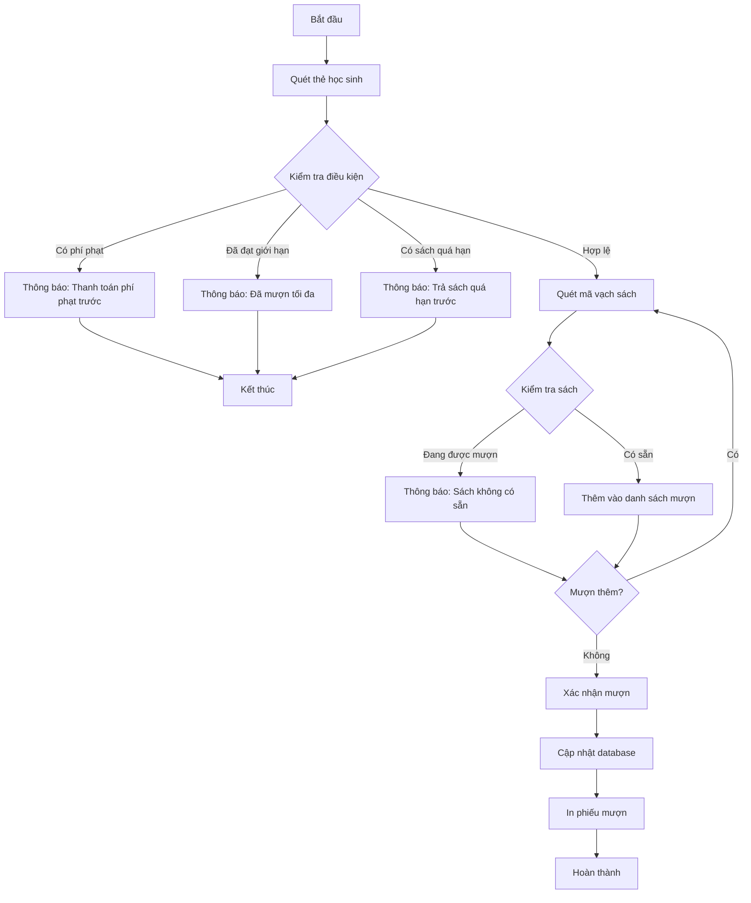
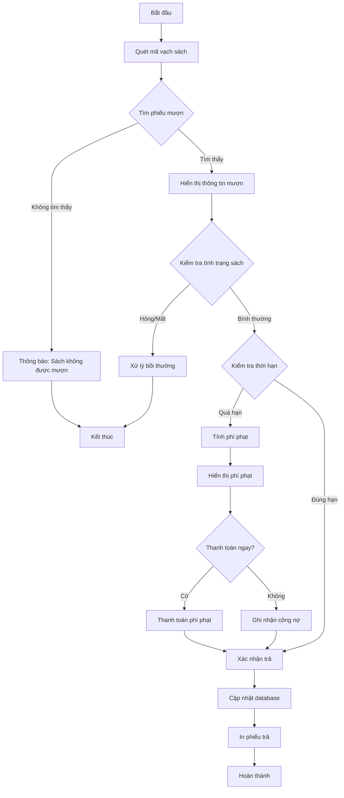

# Mượn và trả sách

## Tổng quan

Chức năng mượn/trả sách là nghiệp vụ cốt lõi của hệ thống thư viện. Hỗ trợ quét mã vạch nhanh chóng và kiểm tra điều kiện tự động.

## Quy trình mượn sách

### Sơ đồ luồng



### Các bước thực hiện

#### 1. Quét thẻ học sinh

```typescript
// Quét mã vạch thẻ học sinh
const reader = await scanReaderCard();

// Lấy thông tin độc giả
const readerInfo = await getReaderInfo(reader.id);
```

#### 2. Kiểm tra điều kiện mượn

**Điều kiện hợp lệ:**

- ✓ Tài khoản đang hoạt động (status = 'active')
- ✓ Thẻ không bị khóa (cardStatus = 'active')
- ✓ Không có phí phạt chưa thanh toán
- ✓ Không có sách quá hạn
- ✓ Chưa đạt giới hạn mượn

```typescript
interface BorrowingEligibility {
  canBorrow: boolean;
  reasons: string[];
  currentBorrowings: number;
  maxBorrowings: number;
  unpaidFines: number;
  overdueBooks: number;
}

async function checkBorrowingEligibility(readerId: string): Promise<BorrowingEligibility> {
  const reader = await getReader(readerId);
  const currentBorrowings = await getCurrentBorrowings(readerId);
  const unpaidFines = await getUnpaidFines(readerId);
  const overdueBooks = await getOverdueBooks(readerId);
  
  const reasons: string[] = [];
  
  if (reader.status !== 'active') {
    reasons.push('Tài khoản không hoạt động');
  }
  
  if (reader.cardStatus !== 'active') {
    reasons.push('Thẻ thư viện bị khóa');
  }
  
  if (unpaidFines > 0) {
    reasons.push(`Có ${formatCurrency(unpaidFines)} phí phạt chưa thanh toán`);
  }
  
  if (overdueBooks > 0) {
    reasons.push(`Có ${overdueBooks} sách quá hạn chưa trả`);
  }
  
  const maxBorrowings = await getMaxBorrowings(reader.type);
  if (currentBorrowings >= maxBorrowings) {
    reasons.push(`Đã mượn tối đa ${maxBorrowings} cuốn`);
  }
  
  return {
    canBorrow: reasons.length === 0,
    reasons,
    currentBorrowings,
    maxBorrowings,
    unpaidFines,
    overdueBooks,
  };
}
```

#### 3. Quét mã vạch sách

```typescript
// Quét mã vạch sách
const bookCopy = await scanBookBarcode();

// Kiểm tra tình trạng sách
const availability = await checkBookAvailability(bookCopy.id);

if (!availability.isAvailable) {
  throw new Error('Sách đang được mượn hoặc không có sẵn');
}
```

#### 4. Tính thời hạn trả

```typescript
async function calculateDueDate(bookId: string, readerType: string): Promise<Date> {
  // Lấy quy định mượn theo loại sách
  const book = await getBook(bookId);
  const rule = await getBorrowingRule(book.categoryId, readerType);
  
  const dueDate = new Date();
  dueDate.setDate(dueDate.getDate() + rule.borrowingDays);
  
  return dueDate;
}
```

#### 5. Xác nhận và lưu

```typescript
interface BorrowingTransaction {
  readerId: string;
  items: Array<{
    bookCopyId: string;
    bookId: string;
    borrowDate: Date;
    dueDate: Date;
  }>;
}

async function createBorrowing(transaction: BorrowingTransaction) {
  // Bắt đầu transaction
  await db.transaction(async (tx) => {
    // Tạo phiếu mượn
    const borrowing = await tx.borrowings.create({
      readerId: transaction.readerId,
      borrowDate: new Date(),
      status: 'borrowed',
    });
    
    // Tạo chi tiết mượn
    for (const item of transaction.items) {
      await tx.borrowingItems.create({
        borrowingId: borrowing.id,
        bookCopyId: item.bookCopyId,
        borrowDate: item.borrowDate,
        dueDate: item.dueDate,
        status: 'borrowed',
      });
      
      // Cập nhật trạng thái sách
      await tx.bookCopies.update({
        where: { id: item.bookCopyId },
        data: { status: 'borrowed' },
      });
    }
    
    return borrowing;
  });
}
```

#### 6. In phiếu mượn

```typescript
async function printBorrowingReceipt(borrowingId: string) {
  const borrowing = await getBorrowingWithDetails(borrowingId);
  
  const html = generateReceiptHTML(borrowing);
  
  // In bằng Electron Print API
  await window.electron.print(html);
}
```

## Quy trình trả sách

### Sơ đồ luồng



### Các bước thực hiện

#### 1. Quét mã vạch sách

```typescript
const bookCopy = await scanBookBarcode();

// Tìm phiếu mượn
const borrowingItem = await findActiveBorrowing(bookCopy.id);

if (!borrowingItem) {
  throw new Error('Sách này không được mượn');
}
```

#### 2. Kiểm tra tình trạng sách

```typescript
enum BookCondition {
  GOOD = 'good',
  DAMAGED = 'damaged',
  LOST = 'lost',
}

interface ReturnCondition {
  condition: BookCondition;
  note?: string;
}

// Thủ thư kiểm tra và chọn tình trạng
const returnCondition: ReturnCondition = await promptBookCondition();
```

#### 3. Tính phí phạt quá hạn

```typescript
async function calculateOverdueFine(borrowingItemId: string): Promise<number> {
  const item = await getBorrowingItem(borrowingItemId);
  
  const now = new Date();
  const dueDate = new Date(item.dueDate);
  
  // Kiểm tra quá hạn
  if (now <= dueDate) {
    return 0; // Không quá hạn
  }
  
  // Tính số ngày quá hạn
  const overdueDays = Math.ceil((now.getTime() - dueDate.getTime()) / (1000 * 60 * 60 * 24));
  
  // Lấy mức phạt theo loại sách
  const book = await getBook(item.bookId);
  const fineRule = await getFineRule(book.categoryId);
  
  const fineAmount = overdueDays * fineRule.finePerDay;
  
  return fineAmount;
}
```

#### 4. Xử lý bồi thường (nếu sách hỏng/mất)

```typescript
async function calculateCompensation(bookId: string, condition: BookCondition): Promise<number> {
  const book = await getBook(bookId);
  
  if (condition === BookCondition.LOST) {
    // Bồi thường 100% giá sách
    return book.price;
  }
  
  if (condition === BookCondition.DAMAGED) {
    // Bồi thường 50% giá sách (có thể cấu hình)
    return book.price * 0.5;
  }
  
  return 0;
}
```

#### 5. Xác nhận trả và cập nhật

```typescript
interface ReturnTransaction {
  borrowingItemId: string;
  returnDate: Date;
  condition: BookCondition;
  overdueFine: number;
  compensationFee: number;
  note?: string;
}

async function processReturn(transaction: ReturnTransaction) {
  await db.transaction(async (tx) => {
    // Cập nhật trạng thái mượn
    await tx.borrowingItems.update({
      where: { id: transaction.borrowingItemId },
      data: {
        returnDate: transaction.returnDate,
        status: 'returned',
        condition: transaction.condition,
      },
    });
    
    // Cập nhật trạng thái sách
    const item = await tx.borrowingItems.findUnique({
      where: { id: transaction.borrowingItemId },
    });
    
    await tx.bookCopies.update({
      where: { id: item.bookCopyId },
      data: {
        status: transaction.condition === BookCondition.GOOD ? 'available' : 'damaged',
      },
    });
    
    // Tạo phí phạt nếu có
    if (transaction.overdueFine > 0 || transaction.compensationFee > 0) {
      await tx.fines.create({
        data: {
          borrowingItemId: transaction.borrowingItemId,
          readerId: item.readerId,
          overdueFine: transaction.overdueFine,
          compensationFee: transaction.compensationFee,
          totalAmount: transaction.overdueFine + transaction.compensationFee,
          status: 'unpaid',
        },
      });
    }
    
    // Kiểm tra và thông báo người đặt trước
    await notifyReservation(item.bookId);
  });
}
```

## Gia hạn sách

### Điều kiện gia hạn

- ✓ Sách chưa quá hạn
- ✓ Không có người đặt trước
- ✓ Chưa gia hạn quá số lần cho phép (không giới hạn theo yêu cầu)

```typescript
async function renewBorrowing(borrowingItemId: string): Promise<Date> {
  const item = await getBorrowingItem(borrowingItemId);
  
  // Kiểm tra quá hạn
  if (new Date() > new Date(item.dueDate)) {
    throw new Error('Không thể gia hạn sách quá hạn');
  }
  
  // Kiểm tra đặt trước
  const hasReservation = await checkReservation(item.bookId);
  if (hasReservation) {
    throw new Error('Sách đã có người đặt trước, không thể gia hạn');
  }
  
  // Tính ngày trả mới
  const book = await getBook(item.bookId);
  const rule = await getBorrowingRule(book.categoryId, item.reader.type);
  
  const newDueDate = new Date(item.dueDate);
  newDueDate.setDate(newDueDate.getDate() + rule.borrowingDays);
  
  // Cập nhật
  await updateBorrowingItem(borrowingItemId, {
    dueDate: newDueDate,
    renewCount: item.renewCount + 1,
  });
  
  return newDueDate;
}
```

## Giao diện

### Màn hình mượn sách

```
┌─────────────────────────────────────────────────────────────┐
│ Mượn sách                                                    │
├─────────────────────────────────────────────────────────────┤
│ Quét thẻ học sinh: [___________________________] [Quét]     │
│                                                              │
│ Thông tin độc giả:                                          │
│ ┌──────────────────────────────────────────────────────┐   │
│ │ Mã: HS2024001          Họ tên: Nguyễn Văn A         │   │
│ │ Lớp: 7A                Đang mượn: 2/5 cuốn          │   │
│ │ Phí phạt: 0đ           Sách quá hạn: 0              │   │
│ └──────────────────────────────────────────────────────┘   │
│                                                              │
│ Quét mã vạch sách: [___________________________] [Quét]     │
│                                                              │
│ Danh sách sách mượn:                                        │
│ ┌──────────────────────────────────────────────────────┐   │
│ │ 1. Toán học 7 - Hạn trả: 06/06/2026        [Xóa]   │   │
│ │ 2. Văn học 7 - Hạn trả: 06/06/2026         [Xóa]   │   │
│ └──────────────────────────────────────────────────────┘   │
│                                                              │
│                    [Hủy]  [Xác nhận mượn]                   │
└─────────────────────────────────────────────────────────────┘
```

### Màn hình trả sách

```
┌─────────────────────────────────────────────────────────────┐
│ Trả sách                                                     │
├─────────────────────────────────────────────────────────────┤
│ Quét mã vạch sách: [___________________________] [Quét]     │
│                                                              │
│ Thông tin mượn:                                             │
│ ┌──────────────────────────────────────────────────────┐   │
│ │ Sách: Toán học 7                                     │   │
│ │ Người mượn: Nguyễn Văn A (HS2024001)                │   │
│ │ Ngày mượn: 07/05/2026                                │   │
│ │ Hạn trả: 06/06/2026                                  │   │
│ │ Trạng thái: Đúng hạn ✓                               │   │
│ └──────────────────────────────────────────────────────┘   │
│                                                              │
│ Tình trạng sách:                                            │
│ ○ Tốt    ○ Hỏng    ○ Mất                                   │
│                                                              │
│ Phí phạt: 0đ                                                │
│                                                              │
│                    [Hủy]  [Xác nhận trả]                    │
└─────────────────────────────────────────────────────────────┘
```

## Quy tắc cấu hình

### Bảng borrowing_rules

```sql
CREATE TABLE borrowing_rules (
  id TEXT PRIMARY KEY,
  category_id TEXT,           -- NULL = áp dụng cho tất cả
  reader_type TEXT NOT NULL,  -- 'student' | 'teacher'
  borrowing_days INTEGER NOT NULL DEFAULT 30,
  max_borrowings INTEGER NOT NULL DEFAULT 5,
  can_renew BOOLEAN NOT NULL DEFAULT TRUE,
  created_at DATETIME DEFAULT CURRENT_TIMESTAMP
);

-- Ví dụ cấu hình
INSERT INTO borrowing_rules VALUES
  ('rule1', NULL, 'student', 30, 5, TRUE),  -- Mặc định học sinh
  ('rule2', NULL, 'teacher', 60, 15, TRUE); -- Mặc định giáo viên
```

## Tài liệu liên quan

- [Quy định nghiệp vụ](../tong-quan/quy-dinh-nghiep-vu.md)
- [Quản lý phạt](./quan-ly-phat.md)
- [Đặt trước sách](./dat-truoc.md)
- [Thiết bị mã vạch](../thiet-bi/ma-vach.md)
- [In ấn](../thiet-bi/in-an.md)
