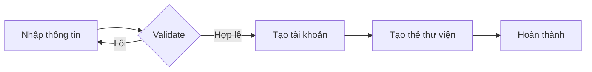

# Quản lý người dùng

## Tổng quan

Hệ thống quản lý người dùng bao gồm quản lý thông tin học sinh, giáo viên, và tài khoản truy cập. Hỗ trợ nhập thủ công và import hàng loạt từ Excel/CSV.

## Phân loại người dùng

### 1. Tài khoản hệ thống (Users)

| Vai trò | Mô tả | Quyền hạn |
|---------|-------|-----------|
| Admin | Quản trị viên hệ thống | Toàn quyền quản lý |
| Thủ thư | Nhân viên thư viện | Quản lý sách, mượn/trả, báo cáo |
| Giáo viên | Giáo viên trường | Mượn sách, tra cứu |
| Học sinh | Học sinh trường | Tra cứu, mượn sách, đánh giá |

### 2. Độc giả (Readers)

Thông tin chi tiết về học sinh và giáo viên sử dụng thư viện.

## Thông tin quản lý

### Thông tin cơ bản

```typescript
interface Reader {
  id: string;
  code: string;              // Mã học sinh/giáo viên
  fullName: string;
  dateOfBirth: Date;
  gender: 'male' | 'female' | 'other';
  email?: string;
  phone?: string;
  photo?: string;            // Ảnh thẻ
  type: 'student' | 'teacher';
  
  // Thông tin học sinh
  grade?: string;            // Khối (1-12)
  class?: string;            // Lớp (1A, 2B, ...)
  
  // Trạng thái
  status: 'active' | 'inactive' | 'graduated';
  cardNumber?: string;       // Số thẻ thư viện
  cardStatus: 'active' | 'blocked' | 'lost';
  
  // Audit
  createdAt: Date;
  updatedAt: Date;
}
```

### Lịch sử mượn sách

Hệ thống lưu trữ **vĩnh viễn** lịch sử mượn sách của mỗi độc giả:

- Sách đã mượn
- Thời gian mượn/trả
- Tình trạng trả (đúng hạn/quá hạn)
- Phí phạt (nếu có)

## Chức năng chính

### 1. Thêm người dùng mới

**Nhập thủ công:**



**Import từ Excel/CSV:**

Định dạng file mẫu:

| Mã HS | Họ tên | Ngày sinh | Giới tính | Lớp | Email | SĐT |
|-------|--------|-----------|-----------|-----|-------|-----|
| HS2024001 | Nguyễn Văn A | 01/01/2010 | Nam | 7A | a@email.com | 0901234567 |

**Quy trình import:**

1. Tải file mẫu
2. Điền thông tin
3. Upload file
4. Xem trước và kiểm tra lỗi
5. Xác nhận import
6. Tạo thẻ thư viện hàng loạt

### 2. Cập nhật thông tin

- Sửa thông tin cá nhân
- Cập nhật lớp/khối (đầu năm học)
- Thay đổi ảnh thẻ
- Cập nhật liên hệ

### 3. Quản lý tài khoản

**Tạo tài khoản:**

- Admin và Thủ thư có quyền tạo tài khoản
- Mật khẩu mặc định: Mã học sinh hoặc tùy chỉnh
- Yêu cầu đổi mật khẩu lần đầu đăng nhập

**Khóa/Mở khóa tài khoản:**

- Khóa tạm thời: Vi phạm quy định
- Khóa vĩnh viễn: Tốt nghiệp, chuyển trường

### 4. Quản lý thẻ thư viện

**Cấp thẻ mới:**

- Tự động khi tạo độc giả mới
- Mã thẻ: `HS{năm}{số thứ tự}` (VD: HS2024001)
- In thẻ với mã vạch

**Báo mất thẻ:**

- Khóa thẻ cũ
- Cấp thẻ mới với mã khác
- Phí làm lại thẻ (tùy chọn)

**Khóa thẻ:**

- Có phí phạt chưa thanh toán
- Vi phạm quy định
- Báo mất

### 5. Xem lịch sử

**Lịch sử mượn sách:**

- Danh sách sách đã mượn
- Thời gian mượn/trả
- Tình trạng (đang mượn/đã trả/quá hạn)
- Phí phạt

**Thống kê cá nhân:**

- Tổng số sách đã mượn
- Số lần quá hạn
- Tổng phí phạt
- Thể loại sách yêu thích

### 6. Tìm kiếm và lọc

**Tìm kiếm theo:**

- Mã học sinh/giáo viên
- Họ tên
- Lớp/Khối
- Email/SĐT
- Số thẻ thư viện

**Lọc theo:**

- Loại (Học sinh/Giáo viên)
- Khối/Lớp
- Trạng thái (Active/Inactive/Graduated)
- Trạng thái thẻ (Active/Blocked/Lost)

### 7. Xử lý tốt nghiệp

**Cuối năm học:**

- Lọc học sinh khối 12
- Kiểm tra sách chưa trả
- Kiểm tra phí phạt chưa thanh toán
- Chuyển trạng thái sang "Graduated"
- Giữ lại lịch sử (không xóa)

## Giao diện

### Danh sách người dùng

```
┌─────────────────────────────────────────────────────────────┐
│ Quản lý Người dùng                          [+ Thêm] [Import]│
├─────────────────────────────────────────────────────────────┤
│ Tìm kiếm: [___________] Lớp: [Tất cả ▼] Trạng thái: [Tất cả ▼]│
├──────┬──────────────┬─────┬──────┬──────────┬────────┬──────┤
│ Mã   │ Họ tên       │ Lớp │ Loại │ Thẻ      │ Trạng  │ Thao │
│      │              │     │      │          │ thái   │ tác  │
├──────┼──────────────┼─────┼──────┼──────────┼────────┼──────┤
│HS001 │ Nguyễn Văn A │ 7A  │ HS   │HS2024001 │ Active │ [...]│
│HS002 │ Trần Thị B   │ 7A  │ HS   │HS2024002 │ Active │ [...]│
│GV001 │ Lê Văn C     │ -   │ GV   │GV2024001 │ Active │ [...]│
└──────┴──────────────┴─────┴──────┴──────────┴────────┴──────┘
```

### Form thêm/sửa

- Tab "Thông tin cơ bản": Mã, họ tên, ngày sinh, giới tính
- Tab "Thông tin học tập": Lớp, khối (nếu là học sinh)
- Tab "Liên hệ": Email, SĐT
- Tab "Ảnh thẻ": Upload ảnh
- Tab "Tài khoản": Username, password, vai trò

### Chi tiết người dùng

- Thông tin cá nhân
- Thẻ thư viện (mã vạch)
- Sách đang mượn
- Lịch sử mượn sách
- Phí phạt chưa thanh toán
- Thống kê

## Quy tắc nghiệp vụ

### Validation

- Mã học sinh/giáo viên: Duy nhất, không trùng
- Email: Format hợp lệ, có thể để trống
- Ngày sinh: Phải nhỏ hơn ngày hiện tại
- Lớp: Bắt buộc với học sinh

### Ràng buộc

- Không xóa người dùng có lịch sử mượn sách
- Không xóa người dùng có phí phạt chưa thanh toán
- Chỉ có thể chuyển sang trạng thái "Inactive"

### Quyền hạn

| Thao tác | Admin | Thủ thư | Giáo viên | Học sinh |
|----------|-------|---------|-----------|----------|
| Xem danh sách | ✓ | ✓ | ✗ | ✗ |
| Thêm mới | ✓ | ✓ | ✗ | ✗ |
| Sửa thông tin | ✓ | ✓ | ✗ | ✗ |
| Xóa/Khóa | ✓ | ✗ | ✗ | ✗ |
| Import | ✓ | ✓ | ✗ | ✗ |
| Xem lịch sử | ✓ | ✓ | Của mình | Của mình |

## API Reference

### Tạo người dùng mới

```typescript
POST /api/readers

Request:
{
  code: string;
  fullName: string;
  dateOfBirth: string;
  gender: 'male' | 'female' | 'other';
  type: 'student' | 'teacher';
  grade?: string;
  class?: string;
  email?: string;
  phone?: string;
}

Response:
{
  id: string;
  code: string;
  cardNumber: string;
  ...
}
```

### Import từ Excel

```typescript
POST /api/readers/import

Request: FormData with file

Response:
{
  success: number;
  failed: number;
  errors: Array<{row: number, message: string}>;
}
```

## Tài liệu liên quan

- [Vai trò người dùng](../tong-quan/nguoi-dung-va-vai-tro.md)
- [Thẻ học sinh](../thiet-bi/the-hoc-sinh.md)
- [Mượn/Trả sách](./muon-tra-sach.md)
- [Database Design](../kien-truc/database-design.md)
