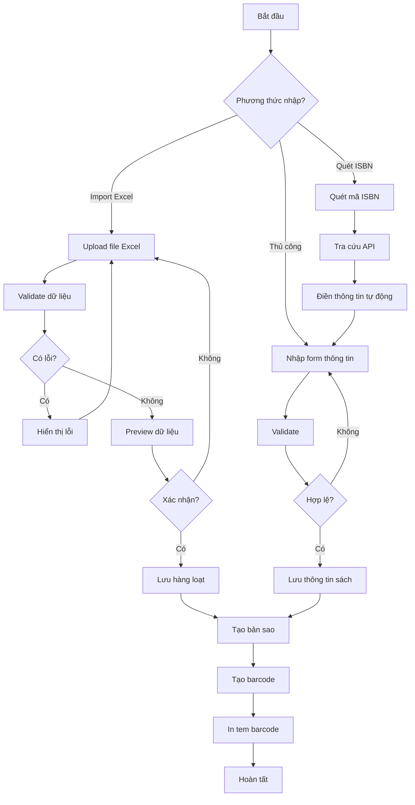
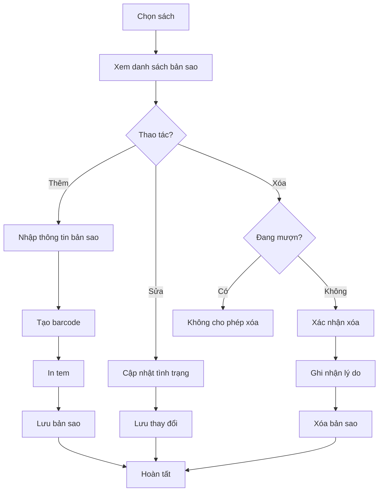

# Quản lý sách

## Tổng quan

Module quản lý sách cung cấp đầy đủ chức năng để quản lý kho sách của thư viện, từ nhập sách, phân loại, đến theo dõi tình trạng và vị trí của từng bản sao.

## Chức năng CRUD

### Thêm sách mới

**Các phương thức nhập:**

1. **Nhập thủ công**
   - Form nhập đầy đủ thông tin sách
   - Validate dữ liệu đầu vào
   - Upload ảnh bìa sách

2. **Quét ISBN (Tự động)**
   - Quét mã ISBN bằng barcode scanner hoặc camera
   - Tự động tra cứu thông tin từ API (Google Books, Open Library)
   - Điền sẵn: Tên sách, tác giả, NXB, năm XB, thể loại, ảnh bìa, tóm tắt
   - Cho phép chỉnh sửa trước khi lưu

3. **Import Excel**
   - Tải template Excel mẫu
   - Upload file Excel chứa danh sách sách
   - Validate dữ liệu hàng loạt
   - Hiển thị preview trước khi import
   - Báo cáo lỗi chi tiết (dòng nào, lỗi gì)

### Xem thông tin sách

**Danh sách sách:**
- Hiển thị dạng bảng hoặc thẻ (card view)
- Tìm kiếm theo: Tên, tác giả, ISBN, thể loại, DDC
- Lọc theo: Thể loại, năm XB, NXB, tình trạng, vị trí
- Sắp xếp theo: Tên, tác giả, năm XB, ngày nhập
- Phân trang

**Chi tiết sách:**
- Thông tin đầy đủ
- Danh sách các bản sao (copies)
- Lịch sử mượn trả
- Thống kê: Số lần mượn, đánh giá trung bình
- Người đang mượn (nếu có)
- Danh sách đặt trước (nếu có)

### Sửa thông tin sách

- Chỉnh sửa mọi trường thông tin
- Lưu lịch sử thay đổi (audit log)
- Quyền hạn: Admin và Thủ thư

### Xóa sách

- Xóa mềm (soft delete): Đánh dấu là đã xóa, không hiển thị
- Không cho phép xóa nếu:
  - Có bản sao đang được mượn
  - Có người đặt trước
- Có thể khôi phục sách đã xóa
- Xóa vĩnh viễn: Chỉ Admin, yêu cầu xác nhận

## Thông tin sách

### Thông tin cơ bản

| Trường | Kiểu | Bắt buộc | Mô tả |
|--------|------|----------|-------|
| ISBN | String | Không | Mã ISBN-10 hoặc ISBN-13 |
| Tên sách | String | Có | Tên đầy đủ của sách |
| Tác giả | String | Có | Tên tác giả (có thể nhiều tác giả) |
| Nhà xuất bản | String | Có | Tên NXB |
| Năm xuất bản | Integer | Có | Năm phát hành |
| Ngôn ngữ | String | Có | Tiếng Việt, English, etc. |
| Số trang | Integer | Không | Tổng số trang |

### Phân loại

| Trường | Kiểu | Bắt buộc | Mô tả |
|--------|------|----------|-------|
| Thể loại | String | Có | Văn học, Khoa học, Lịch sử, etc. |
| DDC | String | Không | Mã phân loại Dewey Decimal |
| Từ khóa | Array | Không | Tags để tìm kiếm |

### Vị trí và số lượng

| Trường | Kiểu | Bắt buộc | Mô tả |
|--------|------|----------|-------|
| Vị trí | String | Có | Kệ A1, Tủ B2, etc. |
| Tổng số bản | Integer | Có | Tổng số bản sao |
| Số bản có sẵn | Integer | Tự động | Số bản chưa mượn |
| Số bản đang mượn | Integer | Tự động | Số bản đang được mượn |

### Tình trạng

- **Có sẵn**: Có ít nhất 1 bản có thể mượn
- **Đang mượn hết**: Tất cả bản đang được mượn
- **Đang bảo trì**: Tạm thời không cho mượn
- **Mất/Hỏng**: Đã mất hoặc hư hỏng

### Nội dung mở rộng

| Trường | Kiểu | Bắt buộc | Mô tả |
|--------|------|----------|-------|
| Ảnh bìa | File/URL | Không | Ảnh bìa sách |
| Tóm tắt | Text | Không | Nội dung tóm tắt |
| Mục lục | Text | Không | Danh sách chương |

## Quản lý bản sao (Copies)

Mỗi cuốn sách vật lý là một bản sao, có barcode riêng để quản lý.

### Thông tin bản sao

| Trường | Kiểu | Mô tả |
|--------|------|-------|
| Barcode | String | Mã vạch duy nhất, dán lên sách |
| Số thứ tự | Integer | Bản số 1, 2, 3... |
| Tình trạng | Enum | Mới, Tốt, Cũ, Hỏng |
| Trạng thái | Enum | Có sẵn, Đang mượn, Bảo trì, Mất |
| Ngày nhập | Date | Ngày nhập vào thư viện |
| Nguồn gốc | Enum | Mua, Tặng, Trao đổi |
| Giá trị | Decimal | Giá trị sách (để tính phạt nếu mất) |
| Ghi chú | Text | Ghi chú về bản sao |

### Thao tác với bản sao

1. **Thêm bản sao mới**
   - Tạo barcode tự động hoặc nhập thủ công
   - In tem barcode để dán lên sách
   - Ghi nhận nguồn gốc và giá trị

2. **Cập nhật tình trạng**
   - Đánh giá tình trạng vật lý: Mới → Tốt → Cũ → Hỏng
   - Chuyển trạng thái: Có sẵn ↔ Bảo trì ↔ Mất

3. **Xóa bản sao**
   - Chỉ xóa được khi không đang mượn
   - Ghi nhận lý do: Mất, Hỏng không sửa được, Thanh lý

4. **Lịch sử bản sao**
   - Lịch sử mượn trả
   - Lịch sử thay đổi tình trạng
   - Người mượn cuối cùng

## Phân loại Dewey Decimal Classification (DDC)

### Giới thiệu

DDC là hệ thống phân loại thư viện phổ biến nhất thế giới, chia kiến thức thành 10 lớp chính.

### 10 lớp chính

| Mã | Lớp | Mô tả |
|----|-----|-------|
| 000 | Khoa học máy tính & Thông tin | Máy tính, Internet, Thư viện |
| 100 | Triết học & Tâm lý học | Triết học, Tâm lý, Logic |
| 200 | Tôn giáo | Các tôn giáo, Thần thoại |
| 300 | Khoa học xã hội | Xã hội học, Chính trị, Kinh tế, Giáo dục |
| 400 | Ngôn ngữ | Ngôn ngữ học, Từ điển |
| 500 | Khoa học tự nhiên | Toán, Vật lý, Hóa học, Sinh học |
| 600 | Công nghệ | Y học, Kỹ thuật, Nông nghiệp |
| 700 | Nghệ thuật & Giải trí | Hội họa, Âm nhạc, Thể thao |
| 800 | Văn học | Thơ, Tiểu thuyết, Kịch |
| 900 | Lịch sử & Địa lý | Lịch sử, Địa lý, Tiểu sử |

### Cách sử dụng

1. **Tự động gợi ý**: Khi nhập thể loại, hệ thống gợi ý mã DDC phù hợp
2. **Tìm kiếm theo DDC**: Duyệt sách theo cây phân loại DDC
3. **In nhãn DDC**: In nhãn dán lên gáy sách

### Ví dụ phân loại

- **004**: Khoa học máy tính
  - **004.6**: Mạng máy tính
  - **004.67**: Mạng diện rộng (Internet)
- **510**: Toán học
  - **512**: Đại số
  - **516**: Hình học
- **823**: Văn học tiểu thuyết tiếng Anh
  - **823.914**: Tiểu thuyết thế kỷ 21

## Xuất nhập tồn

### Nhập kho

**Thông tin nhập:**
- Ngày nhập
- Nguồn gốc: Mua, Tặng, Trao đổi
- Nhà cung cấp (nếu mua)
- Người tặng (nếu tặng)
- Số lượng
- Giá trị (nếu mua)
- Hóa đơn/Chứng từ

**Quy trình:**
1. Tạo phiếu nhập kho
2. Nhập thông tin sách (hoặc chọn sách có sẵn)
3. Tạo bản sao với barcode
4. In tem barcode
5. Dán tem và xếp sách vào kệ
6. Hoàn tất phiếu nhập

### Xuất kho

**Lý do xuất:**
- Thanh lý (sách cũ, hỏng)
- Tặng/Trao đổi
- Mất (không tìm thấy)
- Hỏng không sửa được

**Quy trình:**
1. Tạo phiếu xuất kho
2. Chọn bản sao cần xuất
3. Ghi rõ lý do
4. Phê duyệt (Admin)
5. Cập nhật trạng thái bản sao
6. Hoàn tất phiếu xuất

### Kiểm kê

**Mục đích:**
- Đối chiếu số liệu thực tế với hệ thống
- Phát hiện sách mất, hỏng
- Cập nhật tình trạng sách

**Quy trình:**
1. Tạo phiếu kiểm kê
2. Quét barcode từng bản sao
3. Hệ thống so sánh với dữ liệu
4. Báo cáo: Thiếu, thừa, sai lệch
5. Điều chỉnh dữ liệu
6. Hoàn tất kiểm kê

### Báo cáo xuất nhập tồn

- **Báo cáo nhập kho**: Theo ngày, tháng, năm, nguồn gốc
- **Báo cáo xuất kho**: Theo lý do, thời gian
- **Báo cáo tồn kho**: Tổng số sách, theo thể loại, theo vị trí
- **Báo cáo kiểm kê**: Sách thiếu, sách thừa, sai lệch

## Tìm kiếm và lọc nâng cao

### Tìm kiếm

**Tìm kiếm đơn giản:**
- Tìm theo từ khóa trong: Tên sách, tác giả, ISBN, thể loại

**Tìm kiếm nâng cao:**
- Kết hợp nhiều điều kiện
- Tìm theo khoảng (năm XB từ...đến...)
- Tìm theo DDC
- Tìm theo vị trí
- Tìm theo tình trạng

### Lọc

- **Thể loại**: Chọn một hoặc nhiều thể loại
- **Năm xuất bản**: Khoảng năm
- **Nhà xuất bản**: Chọn NXB
- **Tình trạng**: Có sẵn, Đang mượn hết, Bảo trì
- **Vị trí**: Kệ, tủ
- **Ngôn ngữ**: Tiếng Việt, English, etc.

### Sắp xếp

- Tên sách (A-Z, Z-A)
- Tác giả (A-Z, Z-A)
- Năm xuất bản (Mới nhất, Cũ nhất)
- Ngày nhập (Mới nhất, Cũ nhất)
- Số lần mượn (Nhiều nhất, Ít nhất)

## Thống kê và báo cáo

### Thống kê tổng quan

- Tổng số đầu sách
- Tổng số bản sao
- Số sách có sẵn
- Số sách đang mượn
- Số sách bảo trì/mất

### Báo cáo

1. **Báo cáo theo thể loại**
   - Số lượng sách theo từng thể loại
   - Biểu đồ tròn phân bố

2. **Báo cáo sách phổ biến**
   - Top 10/20/50 sách được mượn nhiều nhất
   - Theo thời gian: Tháng, quý, năm

3. **Báo cáo sách ít được mượn**
   - Sách chưa được mượn lần nào
   - Sách không được mượn trong 6 tháng/1 năm

4. **Báo cáo sách mới**
   - Sách nhập trong tháng/quý/năm
   - Theo nguồn gốc

5. **Báo cáo tình trạng sách**
   - Số sách theo tình trạng vật lý
   - Sách cần bảo trì/thay thế

## Quyền hạn

| Chức năng | Admin | Thủ thư | Độc giả |
|-----------|-------|---------|---------|
| Xem danh sách sách | ✓ | ✓ | ✓ |
| Xem chi tiết sách | ✓ | ✓ | ✓ |
| Thêm sách mới | ✓ | ✓ | ✗ |
| Sửa thông tin sách | ✓ | ✓ | ✗ |
| Xóa sách | ✓ | ✓ | ✗ |
| Quản lý bản sao | ✓ | ✓ | ✗ |
| Nhập/Xuất kho | ✓ | ✓ | ✗ |
| Kiểm kê | ✓ | ✓ | ✗ |
| Xem báo cáo | ✓ | ✓ | ✗ |

## Giao diện

### Màn hình danh sách

```
┌─────────────────────────────────────────────────────────────┐
│ Quản lý sách                                    [+ Thêm sách]│
├─────────────────────────────────────────────────────────────┤
│ [Tìm kiếm...]                    [Lọc ▼] [Sắp xếp ▼] [⚙️]   │
├─────────────────────────────────────────────────────────────┤
│ ┌─────┬──────────────┬────────────┬──────┬─────────┬──────┐ │
│ │ Ảnh │ Tên sách     │ Tác giả    │ NXB  │ Có sẵn  │ ...  │ │
│ ├─────┼──────────────┼────────────┼──────┼─────────┼──────┤ │
│ │ 📖  │ Dế Mèn...    │ Tô Hoài    │ NXB  │ 3/5     │ [>]  │ │
│ │ 📖  │ Số đỏ        │ Vũ Trọng   │ NXB  │ 0/2     │ [>]  │ │
│ └─────┴──────────────┴────────────┴──────┴─────────┴──────┘ │
│                                          [1] [2] [3] ... [10]│
└─────────────────────────────────────────────────────────────┘
```

### Màn hình chi tiết

```
┌─────────────────────────────────────────────────────────────┐
│ [← Quay lại]                          [Sửa] [Xóa] [In QR]   │
├─────────────────────────────────────────────────────────────┤
│ ┌─────────┐  Dế Mèn phưu lưu ký                             │
│ │         │  Tác giả: Tô Hoài                               │
│ │  [Ảnh]  │  NXB: Kim Đồng | Năm: 2020                      │
│ │  bìa    │  Thể loại: Văn học thiếu nhi                    │
│ │         │  DDC: 895.92234 | Vị trí: Kệ A1                 │
│ └─────────┘  ISBN: 978-604-2-15234-5                        │
│                                                              │
│ Tóm tắt:                                                     │
│ Câu chuyện về chú dế mèn dũng cảm...                        │
│                                                              │
│ ┌─ Bản sao (5) ────────────────────────────────────────────┐│
│ │ Barcode      │ Tình trạng │ Trạng thái  │ Người mượn     ││
│ │ BK001234     │ Tốt        │ Có sẵn      │ -              ││
│ │ BK001235     │ Tốt        │ Đang mượn   │ Nguyễn Văn A   ││
│ └──────────────────────────────────────────────────────────┘│
│                                                              │
│ [Tab: Lịch sử mượn] [Tab: Thống kê] [Tab: Đánh giá]        │
└─────────────────────────────────────────────────────────────┘
```

## Luồng nghiệp vụ

### Luồng nhập sách mới



### Luồng quản lý bản sao


