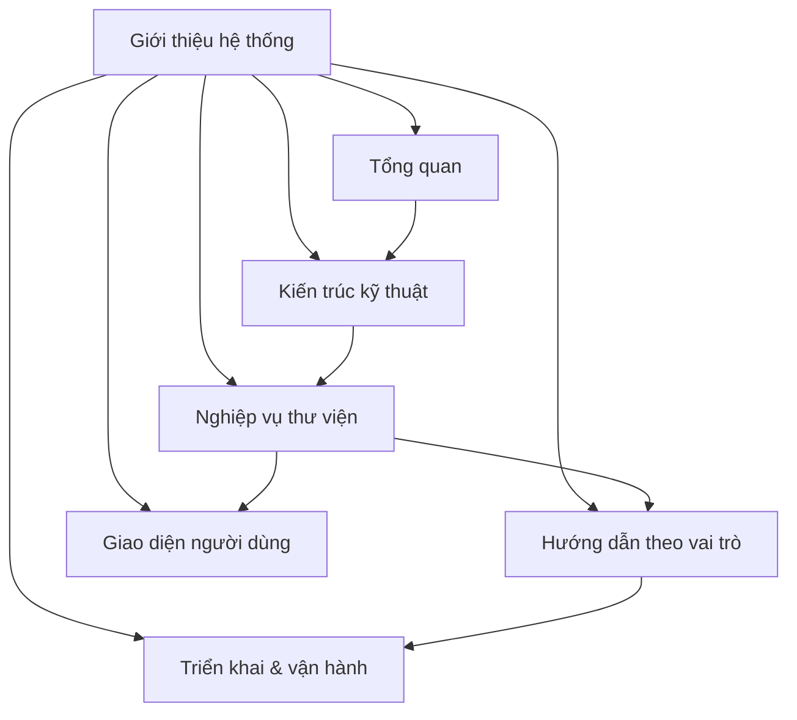

# Hệ thống quản lý thư viện trường học

`Hệ thống quản lý thư viện trường học` là ứng dụng desktop được xây dựng trên nền tảng ElectronJS, React và Better-SQLite3, được thiết kế để phục vụ hoạt động quản lý thư viện tại một trường học với quy mô dưới 500 học sinh.

## Đặc điểm nổi bật

- **Offline-first**: Hoạt động hoàn toàn độc lập, không cần kết nối internet
- **Desktop application**: Cài đặt và chạy trực tiếp trên máy tính Windows/macOS/Linux
- **Single-school**: Dữ liệu và cấu hình dành riêng cho một trường học
- **Lightweight**: Phù hợp với trường học quy mô nhỏ và vừa (< 500 học sinh)
- **Tech stack**: ElectronJS + React + Better-SQLite3

## Mục tiêu của bộ tài liệu

- Cung cấp nguồn tài liệu tham khảo duy nhất cho BA, dev, QA và đội triển khai
- Chuẩn hóa ngôn ngữ giữa nghiệp vụ thư viện và kỹ thuật phát triển
- Mô tả rõ luồng nghiệp vụ, cấu trúc dữ liệu và quy trình vận hành
- Hướng dẫn sử dụng chi tiết theo từng vai trò người dùng

## Bốn vai trò chính

| Vai trò | Phạm vi trách nhiệm | Quyền hạn chính |
| :-- | :-- | :-- |
| Admin | Cấu hình hệ thống, quản lý người dùng, sao lưu dữ liệu | Toàn quyền trên hệ thống |
| Thủ thư | Quản lý sách, mượn/trả, xử phạt, báo cáo | Quản lý toàn bộ nghiệp vụ thư viện |
| Giáo viên | Tra cứu sách, mượn/trả sách, xem lịch sử | Thao tác với tài khoản cá nhân |
| Học sinh | Tra cứu sách, xem lịch sử mượn, xem phạt | Chỉ xem thông tin cá nhân |

## Giả định nền

- Hệ thống phục vụ một trường học duy nhất
- Quy mô học sinh dưới 500 người
- Dữ liệu lưu trữ local trên máy tính cài đặt
- Không yêu cầu đồng bộ giữa nhiều máy
- Sao lưu dữ liệu thực hiện thủ công hoặc theo lịch tự động
- Mỗi sách có thể có nhiều bản (copy) vật lý

## Sơ đồ bản đồ tài liệu

## Trình tự đọc đề xuất

1. Đọc [Tầm nhìn và phạm vi](./tong-quan/tam-nhin-va-pham-vi.md) để hiểu phạm vi và mục tiêu
2. Tìm hiểu [Kiến trúc tổng thể](./kien-truc/tong-quan-kien-truc.md) và [Thiết kế Database](./kien-truc/database-design.md)
3. Nắm rõ các [Chức năng cốt lõi](./chuc-nang/quan-ly-sach.md) như quản lý sách, mượn/trả, phạt
4. Tra cứu [Vai trò người dùng](./tong-quan/nguoi-dung-va-vai-tro.md) để hiểu phân quyền
5. Tham khảo [Hướng dẫn phát triển](./huong-dan-phat-trien/cai-dat-moi-truong.md) nếu tham gia phát triển
6. Xem [Hướng dẫn triển khai](./trien-khai/cai-dat-lan-dau.md) để cài đặt và vận hành

## Nguyên tắc biên soạn

- Mỗi trang nghiệp vụ mô tả rõ actor, luồng xử lý, dữ liệu và giao diện liên quan
- Mỗi trang kiến trúc nêu rõ công nghệ, cấu trúc code và quyết định thiết kế
- Mỗi handbook vai trò tập trung vào nhiệm vụ, quyền hạn và hướng dẫn thao tác cụ thể
- Sử dụng sơ đồ, bảng biểu và ví dụ minh họa để tăng tính trực quan

> Bộ tài liệu này mô tả trạng thái mục tiêu (target-state) của hệ thống. Các tính năng đang trong quá trình phát triển sẽ được đánh dấu rõ ràng để định hướng cho các giai đoạn triển khai tiếp theo.
