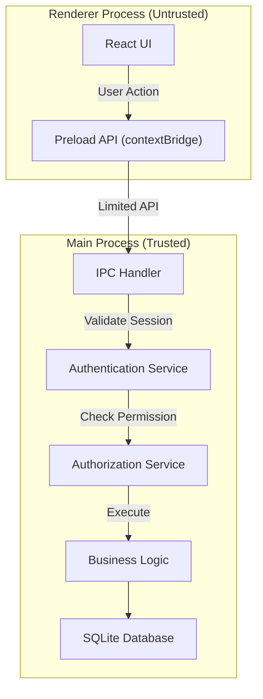

# Bảo mật và phân quyền

## Mục tiêu bảo mật

- Xác thực người dùng đơn giản nhưng an toàn
- Phân quyền rõ ràng theo vai trò (RBAC)
- Bảo vệ dữ liệu local khỏi truy cập trái phép
- Audit trail đầy đủ cho các thao tác quan trọng
- Bảo vệ IPC communication giữa Main và Renderer Process

## Kiến trúc bảo mật Electron



## 1. Xác thực (Authentication)

### Mô hình đơn giản

Hệ thống sử dụng xác thực local với username/password, không cần OAuth hay JWT phức tạp.

### Mã hóa mật khẩu

**Sử dụng bcrypt:**

```typescript
// main/services/auth.service.ts
import bcrypt from 'bcrypt';

const SALT_ROUNDS = 10;

export class AuthService {
  async hashPassword(password: string): Promise<string> {
    return await bcrypt.hash(password, SALT_ROUNDS);
  }
  
  async verifyPassword(password: string, hash: string): Promise<boolean> {
    return await bcrypt.compare(password, hash);
  }
  
  async login(username: string, password: string): Promise<User | null> {
    const user = db.prepare('SELECT * FROM users WHERE username = ?').get(username);
    
    if (!user || !user.is_active) {
      return null;
    }
    
    const isValid = await this.verifyPassword(password, user.password_hash);
    if (!isValid) {
      return null;
    }
    
    // Update last login
    db.prepare('UPDATE users SET last_login_at = ? WHERE id = ?')
      .run(new Date().toISOString(), user.id);
    
    // Create session
    const session = this.createSession(user);
    
    return { ...user, password_hash: undefined };
  }
}
```

### Quản lý Session

**Session trong memory (Main Process):**

```typescript
// main/services/session.service.ts
import crypto from 'crypto';

interface Session {
  sessionId: string;
  userId: number;
  username: string;
  role: string;
  createdAt: Date;
  expiresAt: Date;
}

export class SessionService {
  private sessions = new Map<string, Session>();
  private readonly SESSION_DURATION = 8 * 60 * 60 * 1000; // 8 hours
  
  createSession(user: User): string {
    const sessionId = crypto.randomBytes(32).toString('hex');
    
    const session: Session = {
      sessionId,
      userId: user.id,
      username: user.username,
      role: user.role,
      createdAt: new Date(),
      expiresAt: new Date(Date.now() + this.SESSION_DURATION),
    };
    
    this.sessions.set(sessionId, session);
    return sessionId;
  }
  
  getSession(sessionId: string): Session | null {
    const session = this.sessions.get(sessionId);
    
    if (!session) {
      return null;
    }
    
    if (session.expiresAt < new Date()) {
      this.sessions.delete(sessionId);
      return null;
    }
    
    return session;
  }
  
  destroySession(sessionId: string): void {
    this.sessions.delete(sessionId);
  }
  
  // Cleanup expired sessions periodically
  cleanupExpiredSessions(): void {
    const now = new Date();
    for (const [id, session] of this.sessions.entries()) {
      if (session.expiresAt < now) {
        this.sessions.delete(id);
      }
    }
  }
}
```

### Preload Script an toàn

```typescript
// preload/index.ts
import { contextBridge, ipcRenderer } from 'electron';

// Expose limited API to Renderer
contextBridge.exposeInMainWorld('electronAPI', {
  // Auth
  login: (username: string, password: string) => 
    ipcRenderer.invoke('auth:login', username, password),
  logout: () => 
    ipcRenderer.invoke('auth:logout'),
  getCurrentUser: () => 
    ipcRenderer.invoke('auth:getCurrentUser'),
  
  // Books
  getBooks: (filters: any) => 
    ipcRenderer.invoke('books:getAll', filters),
  createBook: (data: any) => 
    ipcRenderer.invoke('books:create', data),
  
  // Borrowings
  borrowBook: (readerId: number, bookCopyId: number) => 
    ipcRenderer.invoke('borrowings:create', readerId, bookCopyId),
  returnBook: (borrowingId: number) => 
    ipcRenderer.invoke('borrowings:return', borrowingId),
  
  // ... other safe APIs
});
```

## 2. Phân quyền (Authorization)

### Mô hình RBAC (Role-Based Access Control)

| Vai trò | Quyền hạn |
|:--------|:----------|
| **admin** | Toàn quyền: quản lý người dùng, cấu hình hệ thống, backup/restore, xem tất cả báo cáo |
| **librarian** | Quản lý sách, độc giả, mượn/trả, phí phạt, đặt trước, báo cáo thống kê |
| **staff** | Chỉ ghi nhận mượn/trả, tra cứu sách và độc giả, không sửa/xóa |

### Ma trận phân quyền

| Chức năng | admin | librarian | staff |
|:----------|:-----:|:---------:|:-----:|
| Quản lý người dùng | ✓ | ✗ | ✗ |
| Thêm/sửa/xóa sách | ✓ | ✓ | ✗ |
| Xem danh sách sách | ✓ | ✓ | ✓ |
| Thêm/sửa/xóa độc giả | ✓ | ✓ | ✗ |
| Xem thông tin độc giả | ✓ | ✓ | ✓ |
| Mượn sách | ✓ | ✓ | ✓ |
| Trả sách | ✓ | ✓ | ✓ |
| Gia hạn sách | ✓ | ✓ | ✗ |
| Quản lý phí phạt | ✓ | ✓ | ✗ |
| Miễn phí phạt | ✓ | ✓ | ✗ |
| Quản lý đặt trước | ✓ | ✓ | ✗ |
| Kiểm kê sách | ✓ | ✓ | ✗ |
| Xem báo cáo | ✓ | ✓ | ✗ |
| Cấu hình hệ thống | ✓ | ✗ | ✗ |
| Backup/Restore | ✓ | ✗ | ✗ |

### Triển khai Authorization

```typescript
// main/services/authorization.service.ts
type Permission = 
  | 'users:manage'
  | 'books:create' | 'books:update' | 'books:delete' | 'books:view'
  | 'readers:create' | 'readers:update' | 'readers:delete' | 'readers:view'
  | 'borrowings:create' | 'borrowings:return' | 'borrowings:renew'
  | 'fines:manage' | 'fines:waive'
  | 'reservations:manage'
  | 'inventory:manage'
  | 'reports:view'
  | 'settings:manage'
  | 'backup:manage';

const ROLE_PERMISSIONS: Record<string, Permission[]> = {
  admin: [
    'users:manage',
    'books:create', 'books:update', 'books:delete', 'books:view',
    'readers:create', 'readers:update', 'readers:delete', 'readers:view',
    'borrowings:create', 'borrowings:return', 'borrowings:renew',
    'fines:manage', 'fines:waive',
    'reservations:manage',
    'inventory:manage',
    'reports:view',
    'settings:manage',
    'backup:manage',
  ],
  librarian: [
    'books:create', 'books:update', 'books:delete', 'books:view',
    'readers:create', 'readers:update', 'readers:delete', 'readers:view',
    'borrowings:create', 'borrowings:return', 'borrowings:renew',
    'fines:manage', 'fines:waive',
    'reservations:manage',
    'inventory:manage',
    'reports:view',
  ],
  staff: [
    'books:view',
    'readers:view',
    'borrowings:create', 'borrowings:return',
  ],
};

export class AuthorizationService {
  hasPermission(role: string, permission: Permission): boolean {
    const permissions = ROLE_PERMISSIONS[role] || [];
    return permissions.includes(permission);
  }
  
  checkPermission(session: Session, permission: Permission): void {
    if (!this.hasPermission(session.role, permission)) {
      throw new Error(`Permission denied: ${permission}`);
    }
  }
}
```

### IPC Handler với Authorization

```typescript
// main/ipc/books.handler.ts
import { ipcMain } from 'electron';

ipcMain.handle('books:create', async (event, bookData) => {
  const session = sessionService.getSessionByWebContentsId(event.sender.id);
  
  if (!session) {
    throw new Error('Unauthorized: No active session');
  }
  
  // Check permission
  authorizationService.checkPermission(session, 'books:create');
  
  // Execute business logic
  const book = await bookService.createBook(bookData, session.userId);
  
  // Log audit trail
  await auditService.log({
    userId: session.userId,
    action: 'books:create',
    resourceType: 'book',
    resourceId: book.id,
    details: { title: book.title },
  });
  
  return book;
});
```

## 3. Bảo vệ dữ liệu

### File System Permissions

```typescript
// main/services/database.service.ts
import fs from 'fs';
import path from 'path';
import { app } from 'electron';

export class DatabaseService {
  private dbPath: string;
  
  constructor() {
    const userDataPath = app.getPath('userData');
    this.dbPath = path.join(userDataPath, 'library.db');
    
    // Ensure directory exists with restricted permissions
    if (!fs.existsSync(userDataPath)) {
      fs.mkdirSync(userDataPath, { recursive: true, mode: 0o700 });
    }
    
    // Set file permissions (owner read/write only)
    if (fs.existsSync(this.dbPath)) {
      fs.chmodSync(this.dbPath, 0o600);
    }
  }
}
```

### Encryption at Rest (Optional)

Nếu cần mã hóa database:

```typescript
// Sử dụng SQLCipher thay vì Better-SQLite3
import Database from '@journeyapps/sqlcipher';

const db = new Database(dbPath);
db.pragma(`key='${encryptionKey}'`);
```

**Lưu ý:** Với ứng dụng desktop local, encryption at rest là optional. Quan trọng hơn là bảo vệ file permissions.

## 4. Audit Trail

### Ghi log các thao tác quan trọng

```typescript
// main/services/audit.service.ts
interface AuditLog {
  userId: number;
  action: string;
  resourceType: string;
  resourceId?: number;
  oldValue?: any;
  newValue?: any;
  details?: any;
  ipAddress?: string;
  userAgent?: string;
}

export class AuditService {
  async log(data: AuditLog): Promise<void> {
    const stmt = db.prepare(`
      INSERT INTO audit_logs 
      (user_id, action, resource_type, resource_id, old_value, new_value, details, created_at)
      VALUES (?, ?, ?, ?, ?, ?, ?, ?)
    `);
    
    stmt.run(
      data.userId,
      data.action,
      data.resourceType,
      data.resourceId || null,
      data.oldValue ? JSON.stringify(data.oldValue) : null,
      data.newValue ? JSON.stringify(data.newValue) : null,
      data.details ? JSON.stringify(data.details) : null,
      new Date().toISOString()
    );
  }
  
  async getAuditLogs(filters: any): Promise<any[]> {
    // Query audit logs with filters
    // ...
  }
}
```

### Bảng audit_logs

```sql
CREATE TABLE audit_logs (
  id INTEGER PRIMARY KEY AUTOINCREMENT,
  user_id INTEGER NOT NULL,
  action TEXT NOT NULL,
  resource_type TEXT NOT NULL,
  resource_id INTEGER,
  old_value TEXT,
  new_value TEXT,
  details TEXT,
  created_at TEXT NOT NULL DEFAULT (datetime('now')),
  FOREIGN KEY (user_id) REFERENCES users(id)
);

CREATE INDEX idx_audit_logs_user ON audit_logs(user_id);
CREATE INDEX idx_audit_logs_action ON audit_logs(action);
CREATE INDEX idx_audit_logs_resource ON audit_logs(resource_type, resource_id);
CREATE INDEX idx_audit_logs_created ON audit_logs(created_at);
```

### Các thao tác cần audit

- Đăng nhập/đăng xuất
- Tạo/sửa/xóa người dùng
- Tạo/sửa/xóa sách
- Tạo/sửa/xóa độc giả
- Mượn/trả sách
- Gia hạn sách
- Tạo/miễn phí phạt
- Thay đổi cấu hình hệ thống
- Backup/restore database
- Thay đổi quy tắc mượn/phí phạt

## 5. Bảo mật IPC Communication

### Nguyên tắc

1. **Không bao giờ enable `nodeIntegration`** trong Renderer Process
2. **Luôn enable `contextIsolation`**
3. **Sử dụng `contextBridge`** để expose API
4. **Validate tất cả input** từ Renderer
5. **Không expose sensitive data** qua IPC

### Cấu hình BrowserWindow an toàn

```typescript
// main/index.ts
import { app, BrowserWindow } from 'electron';

function createWindow() {
  const mainWindow = new BrowserWindow({
    width: 1200,
    height: 800,
    webPreferences: {
      preload: path.join(__dirname, 'preload.js'),
      nodeIntegration: false,        // MUST be false
      contextIsolation: true,         // MUST be true
      sandbox: true,                  // Enable sandbox
      webSecurity: true,              // Enable web security
      allowRunningInsecureContent: false,
      enableRemoteModule: false,      // Deprecated, but ensure it's false
    },
  });
  
  // Load app
  if (process.env.NODE_ENV === 'development') {
    mainWindow.loadURL('http://localhost:5173');
  } else {
    mainWindow.loadFile(path.join(__dirname, '../renderer/index.html'));
  }
}
```

### Input Validation

```typescript
// main/ipc/borrowings.handler.ts
import { z } from 'zod';

const BorrowBookSchema = z.object({
  readerId: z.number().int().positive(),
  bookCopyId: z.number().int().positive(),
});

ipcMain.handle('borrowings:create', async (event, data) => {
  // Validate input
  const validated = BorrowBookSchema.parse(data);
  
  // Get session
  const session = sessionService.getSessionByWebContentsId(event.sender.id);
  if (!session) {
    throw new Error('Unauthorized');
  }
  
  // Check permission
  authorizationService.checkPermission(session, 'borrowings:create');
  
  // Execute
  return await borrowingService.createBorrowing(
    validated.readerId,
    validated.bookCopyId,
    session.userId
  );
});
```

## 6. Bảo mật bổ sung

### Ngăn chặn SQL Injection

**Luôn sử dụng prepared statements:**

```typescript
// GOOD
const user = db.prepare('SELECT * FROM users WHERE username = ?').get(username);

// BAD - NEVER DO THIS
const user = db.prepare(`SELECT * FROM users WHERE username = '${username}'`).get();
```

### Rate Limiting (Optional)

Giới hạn số lần đăng nhập sai:

```typescript
// main/services/rate-limiter.service.ts
export class RateLimiterService {
  private attempts = new Map<string, { count: number; resetAt: Date }>();
  
  checkLoginAttempt(username: string): boolean {
    const key = `login:${username}`;
    const record = this.attempts.get(key);
    
    if (!record) {
      this.attempts.set(key, { count: 1, resetAt: new Date(Date.now() + 15 * 60 * 1000) });
      return true;
    }
    
    if (record.resetAt < new Date()) {
      this.attempts.delete(key);
      return true;
    }
    
    if (record.count >= 5) {
      return false; // Too many attempts
    }
    
    record.count++;
    return true;
  }
  
  resetLoginAttempts(username: string): void {
    this.attempts.delete(`login:${username}`);
  }
}
```

### Content Security Policy

```typescript
// main/index.ts
mainWindow.webContents.session.webRequest.onHeadersReceived((details, callback) => {
  callback({
    responseHeaders: {
      ...details.responseHeaders,
      'Content-Security-Policy': [
        "default-src 'self'",
        "script-src 'self'",
        "style-src 'self' 'unsafe-inline'",
        "img-src 'self' data:",
      ].join('; '),
    },
  });
});
```

## 7. Checklist bảo mật

### Khi phát triển

- [ ] Không enable `nodeIntegration`
- [ ] Enable `contextIsolation`
- [ ] Sử dụng `contextBridge` cho tất cả IPC API
- [ ] Validate tất cả input từ Renderer
- [ ] Sử dụng prepared statements cho SQL
- [ ] Hash password với bcrypt
- [ ] Kiểm tra session và permission cho mọi IPC handler
- [ ] Ghi audit log cho các thao tác quan trọng
- [ ] Không log sensitive data (password, session token)
- [ ] Set file permissions cho database file

### Khi triển khai

- [ ] Build production với code signing
- [ ] Disable DevTools trong production
- [ ] Sử dụng HTTPS cho external resources (nếu có)
- [ ] Kiểm tra update từ nguồn tin cậy
- [ ] Hướng dẫn người dùng backup định kỳ
- [ ] Cung cấp tài liệu về quyền hạn các vai trò

## Tài liệu liên quan

- [Tổng quan kiến trúc](./tong-quan-kien-truc.md)
- [Thiết kế database](./database-design.md)
- [Công nghệ sử dụng](./cong-nghe.md)
