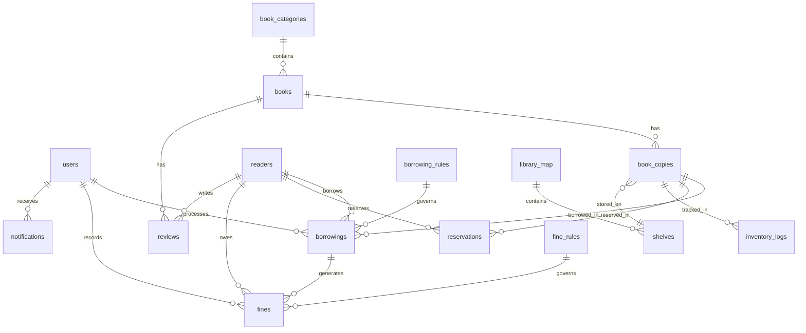

# Thiết kế Database

## Nguyên tắc thiết kế

- Sử dụng SQLite với Better-SQLite3
- Bật foreign key constraints
- Sử dụng transaction cho các thao tác phức tạp
- Lưu timestamp theo UTC, hiển thị theo timezone local
- Soft delete cho các bảng quan trọng (thêm cột `deleted_at`)
- Audit trail cho các thao tác quan trọng

## Sơ đồ ERD tổng quan



## Bảng chi tiết

### 1. users (Người dùng hệ thống)

Quản lý tài khoản đăng nhập của nhân viên thư viện.

```sql
CREATE TABLE users (
  id INTEGER PRIMARY KEY AUTOINCREMENT,
  username TEXT NOT NULL UNIQUE,
  password_hash TEXT NOT NULL,
  full_name TEXT NOT NULL,
  email TEXT,
  role TEXT NOT NULL CHECK(role IN ('admin', 'librarian', 'staff')),
  is_active INTEGER NOT NULL DEFAULT 1,
  created_at TEXT NOT NULL DEFAULT (datetime('now')),
  updated_at TEXT NOT NULL DEFAULT (datetime('now')),
  last_login_at TEXT
);

CREATE INDEX idx_users_username ON users(username);
CREATE INDEX idx_users_role ON users(role);
```

**Vai trò:**
- `admin`: Quản trị viên, toàn quyền
- `librarian`: Thủ thư, quản lý mượn/trả, độc giả
- `staff`: Nhân viên, chỉ xem và ghi nhận mượn/trả

### 2. readers (Độc giả)

Thông tin độc giả đăng ký sử dụng thư viện.

```sql
CREATE TABLE readers (
  id INTEGER PRIMARY KEY AUTOINCREMENT,
  reader_code TEXT NOT NULL UNIQUE,
  full_name TEXT NOT NULL,
  date_of_birth TEXT,
  gender TEXT CHECK(gender IN ('male', 'female', 'other')),
  id_number TEXT,
  phone TEXT,
  email TEXT,
  address TEXT,
  reader_type TEXT NOT NULL CHECK(reader_type IN ('student', 'teacher', 'staff', 'public')),
  registration_date TEXT NOT NULL DEFAULT (date('now')),
  expiry_date TEXT NOT NULL,
  status TEXT NOT NULL DEFAULT 'active' CHECK(status IN ('active', 'suspended', 'expired')),
  photo_path TEXT,
  notes TEXT,
  created_at TEXT NOT NULL DEFAULT (datetime('now')),
  updated_at TEXT NOT NULL DEFAULT (datetime('now'))
);

CREATE INDEX idx_readers_code ON readers(reader_code);
CREATE INDEX idx_readers_type ON readers(reader_type);
CREATE INDEX idx_readers_status ON readers(status);
CREATE INDEX idx_readers_name ON readers(full_name);
```

### 3. book_categories (Danh mục sách)

Phân loại sách theo chủ đề.

```sql
CREATE TABLE book_categories (
  id INTEGER PRIMARY KEY AUTOINCREMENT,
  code TEXT NOT NULL UNIQUE,
  name TEXT NOT NULL,
  parent_id INTEGER,
  description TEXT,
  display_order INTEGER DEFAULT 0,
  created_at TEXT NOT NULL DEFAULT (datetime('now')),
  updated_at TEXT NOT NULL DEFAULT (datetime('now')),
  FOREIGN KEY (parent_id) REFERENCES book_categories(id)
);

CREATE INDEX idx_categories_parent ON book_categories(parent_id);
CREATE INDEX idx_categories_code ON book_categories(code);
```

### 4. books (Đầu sách)

Thông tin về đầu sách (metadata).

```sql
CREATE TABLE books (
  id INTEGER PRIMARY KEY AUTOINCREMENT,
  isbn TEXT UNIQUE,
  title TEXT NOT NULL,
  subtitle TEXT,
  authors TEXT NOT NULL,
  publisher TEXT,
  publish_year INTEGER,
  edition TEXT,
  language TEXT DEFAULT 'vi',
  pages INTEGER,
  category_id INTEGER NOT NULL,
  description TEXT,
  cover_image_path TEXT,
  tags TEXT,
  created_at TEXT NOT NULL DEFAULT (datetime('now')),
  updated_at TEXT NOT NULL DEFAULT (datetime('now')),
  FOREIGN KEY (category_id) REFERENCES book_categories(id)
);

CREATE INDEX idx_books_isbn ON books(isbn);
CREATE INDEX idx_books_title ON books(title);
CREATE INDEX idx_books_category ON books(category_id);
CREATE INDEX idx_books_authors ON books(authors);
CREATE VIRTUAL TABLE books_fts USING fts5(title, authors, description, content=books);
```

### 5. book_copies (Bản sao sách)

Các bản sao vật lý của đầu sách.

```sql
CREATE TABLE book_copies (
  id INTEGER PRIMARY KEY AUTOINCREMENT,
  book_id INTEGER NOT NULL,
  barcode TEXT NOT NULL UNIQUE,
  copy_number INTEGER NOT NULL,
  shelf_id INTEGER,
  status TEXT NOT NULL DEFAULT 'available' 
    CHECK(status IN ('available', 'borrowed', 'reserved', 'maintenance', 'lost', 'damaged')),
  condition TEXT DEFAULT 'good' CHECK(condition IN ('new', 'good', 'fair', 'poor', 'damaged')),
  acquisition_date TEXT NOT NULL DEFAULT (date('now')),
  acquisition_price REAL,
  notes TEXT,
  created_at TEXT NOT NULL DEFAULT (datetime('now')),
  updated_at TEXT NOT NULL DEFAULT (datetime('now')),
  FOREIGN KEY (book_id) REFERENCES books(id),
  FOREIGN KEY (shelf_id) REFERENCES shelves(id),
  UNIQUE(book_id, copy_number)
);

CREATE INDEX idx_copies_barcode ON book_copies(barcode);
CREATE INDEX idx_copies_book ON book_copies(book_id);
CREATE INDEX idx_copies_status ON book_copies(status);
CREATE INDEX idx_copies_shelf ON book_copies(shelf_id);
```

### 6. borrowing_rules (Quy tắc mượn sách)

**QUAN TRỌNG**: Cấu hình động, KHÔNG hardcode.

```sql
CREATE TABLE borrowing_rules (
  id INTEGER PRIMARY KEY AUTOINCREMENT,
  rule_name TEXT NOT NULL,
  reader_type TEXT NOT NULL,
  book_category_id INTEGER,
  max_books INTEGER NOT NULL DEFAULT 3,
  loan_period_days INTEGER NOT NULL DEFAULT 14,
  max_renewals INTEGER NOT NULL DEFAULT 2,
  renewal_period_days INTEGER NOT NULL DEFAULT 7,
  allow_reservation INTEGER NOT NULL DEFAULT 1,
  priority INTEGER DEFAULT 0,
  effective_from TEXT NOT NULL DEFAULT (date('now')),
  effective_to TEXT,
  is_active INTEGER NOT NULL DEFAULT 1,
  created_at TEXT NOT NULL DEFAULT (datetime('now')),
  updated_at TEXT NOT NULL DEFAULT (datetime('now')),
  FOREIGN KEY (book_category_id) REFERENCES book_categories(id)
);

CREATE INDEX idx_borrowing_rules_reader_type ON borrowing_rules(reader_type);
CREATE INDEX idx_borrowing_rules_active ON borrowing_rules(is_active);
```

**Ví dụ cấu hình:**
- Sinh viên: tối đa 5 sách, mượn 14 ngày, gia hạn 2 lần
- Giáo viên: tối đa 10 sách, mượn 30 ngày, gia hạn 3 lần
- Sách tham khảo: chỉ mượn 7 ngày, không gia hạn

### 7. fine_rules (Quy tắc phí phạt)

**QUAN TRỌNG**: Cấu hình động, KHÔNG hardcode.

```sql
CREATE TABLE fine_rules (
  id INTEGER PRIMARY KEY AUTOINCREMENT,
  rule_name TEXT NOT NULL,
  fine_type TEXT NOT NULL CHECK(fine_type IN ('overdue', 'lost', 'damaged')),
  reader_type TEXT,
  book_category_id INTEGER,
  amount_per_day REAL,
  fixed_amount REAL,
  max_amount REAL,
  grace_period_days INTEGER DEFAULT 0,
  calculation_method TEXT DEFAULT 'per_day' 
    CHECK(calculation_method IN ('per_day', 'fixed', 'percentage')),
  effective_from TEXT NOT NULL DEFAULT (date('now')),
  effective_to TEXT,
  is_active INTEGER NOT NULL DEFAULT 1,
  created_at TEXT NOT NULL DEFAULT (datetime('now')),
  updated_at TEXT NOT NULL DEFAULT (datetime('now')),
  FOREIGN KEY (book_category_id) REFERENCES book_categories(id)
);

CREATE INDEX idx_fine_rules_type ON fine_rules(fine_type);
CREATE INDEX idx_fine_rules_active ON fine_rules(is_active);
```

**Ví dụ cấu hình:**
- Trả muộn: 2,000đ/ngày, tối đa 100,000đ
- Làm mất: 200% giá sách
- Làm hỏng: 50-100% giá sách tùy mức độ

### 8. borrowings (Phiếu mượn)

Ghi nhận các lần mượn sách.

```sql
CREATE TABLE borrowings (
  id INTEGER PRIMARY KEY AUTOINCREMENT,
  reader_id INTEGER NOT NULL,
  book_copy_id INTEGER NOT NULL,
  borrow_date TEXT NOT NULL DEFAULT (date('now')),
  due_date TEXT NOT NULL,
  return_date TEXT,
  renewal_count INTEGER NOT NULL DEFAULT 0,
  status TEXT NOT NULL DEFAULT 'active' 
    CHECK(status IN ('active', 'returned', 'overdue', 'lost')),
  borrowing_rule_id INTEGER,
  borrowed_by_user_id INTEGER NOT NULL,
  returned_by_user_id INTEGER,
  notes TEXT,
  created_at TEXT NOT NULL DEFAULT (datetime('now')),
  updated_at TEXT NOT NULL DEFAULT (datetime('now')),
  FOREIGN KEY (reader_id) REFERENCES readers(id),
  FOREIGN KEY (book_copy_id) REFERENCES book_copies(id),
  FOREIGN KEY (borrowing_rule_id) REFERENCES borrowing_rules(id),
  FOREIGN KEY (borrowed_by_user_id) REFERENCES users(id),
  FOREIGN KEY (returned_by_user_id) REFERENCES users(id)
);

CREATE INDEX idx_borrowings_reader ON borrowings(reader_id);
CREATE INDEX idx_borrowings_copy ON borrowings(book_copy_id);
CREATE INDEX idx_borrowings_status ON borrowings(status);
CREATE INDEX idx_borrowings_due_date ON borrowings(due_date);
CREATE INDEX idx_borrowings_borrow_date ON borrowings(borrow_date);
```

### 9. reservations (Đặt trước sách)

Cho phép độc giả đặt trước sách đang được mượn.

```sql
CREATE TABLE reservations (
  id INTEGER PRIMARY KEY AUTOINCREMENT,
  reader_id INTEGER NOT NULL,
  book_copy_id INTEGER NOT NULL,
  reservation_date TEXT NOT NULL DEFAULT (datetime('now')),
  expiry_date TEXT NOT NULL,
  status TEXT NOT NULL DEFAULT 'pending' 
    CHECK(status IN ('pending', 'ready', 'fulfilled', 'cancelled', 'expired')),
  notified_at TEXT,
  fulfilled_at TEXT,
  notes TEXT,
  created_at TEXT NOT NULL DEFAULT (datetime('now')),
  updated_at TEXT NOT NULL DEFAULT (datetime('now')),
  FOREIGN KEY (reader_id) REFERENCES readers(id),
  FOREIGN KEY (book_copy_id) REFERENCES book_copies(id)
);

CREATE INDEX idx_reservations_reader ON reservations(reader_id);
CREATE INDEX idx_reservations_copy ON reservations(book_copy_id);
CREATE INDEX idx_reservations_status ON reservations(status);
CREATE INDEX idx_reservations_expiry ON reservations(expiry_date);
```

### 10. fines (Phí phạt)

Ghi nhận các khoản phí phạt.

```sql
CREATE TABLE fines (
  id INTEGER PRIMARY KEY AUTOINCREMENT,
  borrowing_id INTEGER NOT NULL,
  reader_id INTEGER NOT NULL,
  fine_type TEXT NOT NULL CHECK(fine_type IN ('overdue', 'lost', 'damaged')),
  fine_rule_id INTEGER,
  amount REAL NOT NULL,
  days_overdue INTEGER,
  status TEXT NOT NULL DEFAULT 'unpaid' CHECK(status IN ('unpaid', 'paid', 'waived')),
  issued_date TEXT NOT NULL DEFAULT (date('now')),
  paid_date TEXT,
  paid_amount REAL,
  payment_method TEXT CHECK(payment_method IN ('cash', 'transfer', 'card')),
  waived_reason TEXT,
  issued_by_user_id INTEGER NOT NULL,
  processed_by_user_id INTEGER,
  notes TEXT,
  created_at TEXT NOT NULL DEFAULT (datetime('now')),
  updated_at TEXT NOT NULL DEFAULT (datetime('now')),
  FOREIGN KEY (borrowing_id) REFERENCES borrowings(id),
  FOREIGN KEY (reader_id) REFERENCES readers(id),
  FOREIGN KEY (fine_rule_id) REFERENCES fine_rules(id),
  FOREIGN KEY (issued_by_user_id) REFERENCES users(id),
  FOREIGN KEY (processed_by_user_id) REFERENCES users(id)
);

CREATE INDEX idx_fines_borrowing ON fines(borrowing_id);
CREATE INDEX idx_fines_reader ON fines(reader_id);
CREATE INDEX idx_fines_status ON fines(status);
CREATE INDEX idx_fines_issued_date ON fines(issued_date);
```

### 11. reviews (Đánh giá sách)

Cho phép độc giả đánh giá và nhận xét sách.

```sql
CREATE TABLE reviews (
  id INTEGER PRIMARY KEY AUTOINCREMENT,
  book_id INTEGER NOT NULL,
  reader_id INTEGER NOT NULL,
  rating INTEGER NOT NULL CHECK(rating BETWEEN 1 AND 5),
  review_text TEXT,
  is_approved INTEGER NOT NULL DEFAULT 0,
  approved_by_user_id INTEGER,
  created_at TEXT NOT NULL DEFAULT (datetime('now')),
  updated_at TEXT NOT NULL DEFAULT (datetime('now')),
  FOREIGN KEY (book_id) REFERENCES books(id),
  FOREIGN KEY (reader_id) REFERENCES readers(id),
  FOREIGN KEY (approved_by_user_id) REFERENCES users(id),
  UNIQUE(book_id, reader_id)
);

CREATE INDEX idx_reviews_book ON reviews(book_id);
CREATE INDEX idx_reviews_reader ON reviews(reader_id);
CREATE INDEX idx_reviews_approved ON reviews(is_approved);
```

### 12. notifications (Thông báo)

Thông báo cho độc giả về sách sắp đến hạn, phí phạt, v.v.

```sql
CREATE TABLE notifications (
  id INTEGER PRIMARY KEY AUTOINCREMENT,
  reader_id INTEGER NOT NULL,
  notification_type TEXT NOT NULL 
    CHECK(notification_type IN ('due_soon', 'overdue', 'fine', 'reservation_ready', 'general')),
  title TEXT NOT NULL,
  message TEXT NOT NULL,
  related_id INTEGER,
  related_type TEXT,
  is_read INTEGER NOT NULL DEFAULT 0,
  sent_via TEXT CHECK(sent_via IN ('system', 'email', 'sms')),
  sent_at TEXT,
  created_at TEXT NOT NULL DEFAULT (datetime('now')),
  FOREIGN KEY (reader_id) REFERENCES readers(id)
);

CREATE INDEX idx_notifications_reader ON notifications(reader_id);
CREATE INDEX idx_notifications_type ON notifications(notification_type);
CREATE INDEX idx_notifications_read ON notifications(is_read);
CREATE INDEX idx_notifications_created ON notifications(created_at);
```

### 13. library_map (Sơ đồ thư viện)

Quản lý các khu vực trong thư viện.

```sql
CREATE TABLE library_map (
  id INTEGER PRIMARY KEY AUTOINCREMENT,
  area_code TEXT NOT NULL UNIQUE,
  area_name TEXT NOT NULL,
  floor INTEGER NOT NULL,
  description TEXT,
  display_order INTEGER DEFAULT 0,
  created_at TEXT NOT NULL DEFAULT (datetime('now')),
  updated_at TEXT NOT NULL DEFAULT (datetime('now'))
);

CREATE INDEX idx_library_map_floor ON library_map(floor);
```

### 14. shelves (Kệ sách)

Vị trí cụ thể của sách trong thư viện.

```sql
CREATE TABLE shelves (
  id INTEGER PRIMARY KEY AUTOINCREMENT,
  shelf_code TEXT NOT NULL UNIQUE,
  shelf_name TEXT NOT NULL,
  area_id INTEGER NOT NULL,
  capacity INTEGER,
  current_count INTEGER DEFAULT 0,
  description TEXT,
  created_at TEXT NOT NULL DEFAULT (datetime('now')),
  updated_at TEXT NOT NULL DEFAULT (datetime('now')),
  FOREIGN KEY (area_id) REFERENCES library_map(id)
);

CREATE INDEX idx_shelves_area ON shelves(area_id);
CREATE INDEX idx_shelves_code ON shelves(shelf_code);
```

### 15. inventory_logs (Nhật ký kiểm kê)

Ghi lại lịch sử kiểm kê và di chuyển sách.

```sql
CREATE TABLE inventory_logs (
  id INTEGER PRIMARY KEY AUTOINCREMENT,
  book_copy_id INTEGER NOT NULL,
  action_type TEXT NOT NULL 
    CHECK(action_type IN ('check', 'move', 'status_change', 'condition_change')),
  old_value TEXT,
  new_value TEXT,
  old_shelf_id INTEGER,
  new_shelf_id INTEGER,
  performed_by_user_id INTEGER NOT NULL,
  notes TEXT,
  created_at TEXT NOT NULL DEFAULT (datetime('now')),
  FOREIGN KEY (book_copy_id) REFERENCES book_copies(id),
  FOREIGN KEY (old_shelf_id) REFERENCES shelves(id),
  FOREIGN KEY (new_shelf_id) REFERENCES shelves(id),
  FOREIGN KEY (performed_by_user_id) REFERENCES users(id)
);

CREATE INDEX idx_inventory_logs_copy ON inventory_logs(book_copy_id);
CREATE INDEX idx_inventory_logs_action ON inventory_logs(action_type);
CREATE INDEX idx_inventory_logs_created ON inventory_logs(created_at);
```

### 16. system_settings (Cấu hình hệ thống)

Lưu trữ các cấu hình chung của hệ thống.

```sql
CREATE TABLE system_settings (
  id INTEGER PRIMARY KEY AUTOINCREMENT,
  setting_key TEXT NOT NULL UNIQUE,
  setting_value TEXT NOT NULL,
  setting_type TEXT NOT NULL CHECK(setting_type IN ('string', 'number', 'boolean', 'json')),
  description TEXT,
  is_public INTEGER NOT NULL DEFAULT 0,
  updated_by_user_id INTEGER,
  created_at TEXT NOT NULL DEFAULT (datetime('now')),
  updated_at TEXT NOT NULL DEFAULT (datetime('now')),
  FOREIGN KEY (updated_by_user_id) REFERENCES users(id)
);

CREATE INDEX idx_settings_key ON system_settings(setting_key);
```

**Ví dụ settings:**
- `library_name`: Tên thư viện
- `library_address`: Địa chỉ
- `library_phone`: Số điện thoại
- `auto_backup_enabled`: Bật/tắt backup tự động
- `backup_schedule`: Lịch backup (cron expression)
- `email_enabled`: Bật/tắt gửi email
- `overdue_check_time`: Giờ kiểm tra sách quá hạn hàng ngày

### 17. backups (Lịch sử backup)

Theo dõi các lần backup database.

```sql
CREATE TABLE backups (
  id INTEGER PRIMARY KEY AUTOINCREMENT,
  backup_file_path TEXT NOT NULL,
  backup_size INTEGER NOT NULL,
  backup_type TEXT NOT NULL CHECK(backup_type IN ('manual', 'auto', 'scheduled')),
  status TEXT NOT NULL DEFAULT 'completed' CHECK(status IN ('completed', 'failed')),
  error_message TEXT,
  performed_by_user_id INTEGER,
  created_at TEXT NOT NULL DEFAULT (datetime('now')),
  FOREIGN KEY (performed_by_user_id) REFERENCES users(id)
);

CREATE INDEX idx_backups_created ON backups(created_at);
CREATE INDEX idx_backups_type ON backups(backup_type);
```

## Triggers quan trọng

### Tự động cập nhật updated_at

```sql
CREATE TRIGGER update_users_timestamp 
AFTER UPDATE ON users
BEGIN
  UPDATE users SET updated_at = datetime('now') WHERE id = NEW.id;
END;

-- Tương tự cho các bảng khác
```

### Tự động cập nhật trạng thái sách khi mượn

```sql
CREATE TRIGGER update_book_copy_status_on_borrow
AFTER INSERT ON borrowings
WHEN NEW.status = 'active'
BEGIN
  UPDATE book_copies 
  SET status = 'borrowed', updated_at = datetime('now')
  WHERE id = NEW.book_copy_id;
END;
```

### Tự động cập nhật trạng thái sách khi trả

```sql
CREATE TRIGGER update_book_copy_status_on_return
AFTER UPDATE ON borrowings
WHEN NEW.status = 'returned' AND OLD.status != 'returned'
BEGIN
  UPDATE book_copies 
  SET status = 'available', updated_at = datetime('now')
  WHERE id = NEW.book_copy_id;
END;
```

### Tự động cập nhật số lượng sách trên kệ

```sql
CREATE TRIGGER update_shelf_count_on_add
AFTER UPDATE ON book_copies
WHEN NEW.shelf_id IS NOT NULL AND (OLD.shelf_id IS NULL OR OLD.shelf_id != NEW.shelf_id)
BEGIN
  UPDATE shelves SET current_count = current_count + 1 WHERE id = NEW.shelf_id;
  UPDATE shelves SET current_count = current_count - 1 WHERE id = OLD.shelf_id AND OLD.shelf_id IS NOT NULL;
END;
```

## Views hữu ích

### Thống kê sách đang mượn

```sql
CREATE VIEW v_active_borrowings AS
SELECT 
  b.id,
  b.borrow_date,
  b.due_date,
  b.renewal_count,
  r.reader_code,
  r.full_name as reader_name,
  r.phone as reader_phone,
  bk.title as book_title,
  bk.authors,
  bc.barcode,
  CASE 
    WHEN date(b.due_date) < date('now') THEN 'overdue'
    WHEN date(b.due_date) = date('now') THEN 'due_today'
    WHEN date(b.due_date) <= date('now', '+3 days') THEN 'due_soon'
    ELSE 'active'
  END as borrowing_status,
  julianday('now') - julianday(b.due_date) as days_overdue
FROM borrowings b
JOIN readers r ON b.reader_id = r.id
JOIN book_copies bc ON b.book_copy_id = bc.id
JOIN books bk ON bc.book_id = bk.id
WHERE b.status = 'active';
```

### Thống kê sách phổ biến

```sql
CREATE VIEW v_popular_books AS
SELECT 
  bk.id,
  bk.title,
  bk.authors,
  COUNT(b.id) as borrow_count,
  AVG(COALESCE(rv.rating, 0)) as avg_rating,
  COUNT(DISTINCT rv.id) as review_count
FROM books bk
LEFT JOIN book_copies bc ON bk.id = bc.book_id
LEFT JOIN borrowings b ON bc.id = b.book_copy_id
LEFT JOIN reviews rv ON bk.id = rv.book_id
GROUP BY bk.id
ORDER BY borrow_count DESC;
```

## Indexes quan trọng

Đã được tạo trong các câu lệnh CREATE TABLE ở trên. Các index chính:

- Unique indexes: username, reader_code, barcode, isbn
- Foreign key indexes: Tất cả các foreign key
- Status indexes: Cho các trường status thường xuyên filter
- Date indexes: Cho các trường date thường xuyên sort/filter
- Full-text search: books_fts cho tìm kiếm sách

## Tài liệu liên quan

- [Tổng quan kiến trúc](./tong-quan-kien-truc.md)
- [Công nghệ sử dụng](./cong-nghe.md)
- [Bảo mật](./bao-mat.md)
