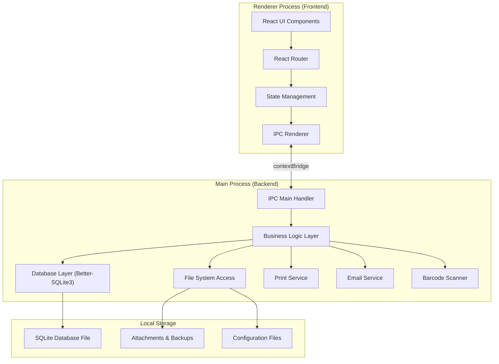
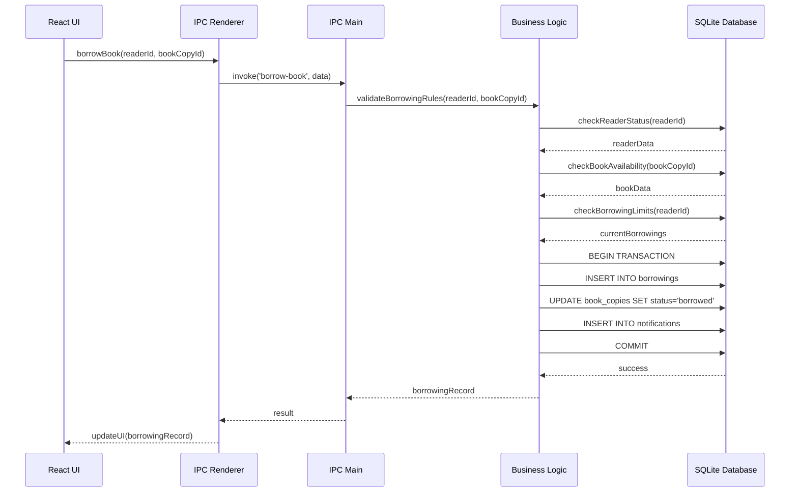

# Tổng quan kiến trúc

## Mục tiêu kiến trúc

- Ứng dụng desktop độc lập chạy offline-first, không phụ thuộc internet
- Tách biệt rõ ràng giữa Main Process (backend) và Renderer Process (frontend)
- Dữ liệu lưu trữ local với SQLite, có khả năng backup và restore
- Giao tiếp an toàn giữa các process thông qua IPC (Inter-Process Communication)
- Hỗ trợ in ấn, quét barcode và gửi email thông báo

## Sơ đồ kiến trúc high-level

## Thành phần chính

### 1. Renderer Process (Frontend)

| Thành phần | Mô tả |
|:-----------|:------|
| React UI | Giao diện người dùng với React 18, TypeScript |
| React Router | Điều hướng giữa các màn hình |
| State Management | Quản lý trạng thái ứng dụng (Redux Toolkit hoặc Zustand) |
| TailwindCSS | Styling và responsive design |
| IPC Renderer | Giao tiếp với Main Process qua preload script |

### 2. Main Process (Backend)

| Thành phần | Mô tả |
|:-----------|:------|
| IPC Handler | Xử lý các request từ Renderer Process |
| Business Logic | Logic nghiệp vụ: mượn/trả sách, tính phí phạt, quản lý độc giả |
| Database Layer | Truy vấn và cập nhật SQLite database |
| File System | Quản lý file backup, attachments, exports |
| Print Service | In thẻ độc giả, phiếu mượn/trả, báo cáo |
| Email Service | Gửi thông báo nhắc trả sách, thông báo phí phạt |
| Barcode Scanner | Tích hợp quét mã vạch sách và thẻ độc giả |

### 3. Local Storage

| Thành phần | Mô tả |
|:-----------|:------|
| SQLite Database | File .db chứa toàn bộ dữ liệu hệ thống |
| Attachments | Ảnh bìa sách, ảnh độc giả |
| Backups | File backup tự động và thủ công |
| Configuration | Cấu hình hệ thống, quy tắc mượn/trả |

## Quy tắc thiết kế

### Separation of Concerns

1. **Renderer Process** chỉ xử lý UI và user interaction
2. **Main Process** xử lý toàn bộ business logic và database access
3. **Không** truy cập trực tiếp database từ Renderer Process
4. **Không** xử lý business logic trong Renderer Process

### Offline-First

1. Toàn bộ dữ liệu lưu trữ local, không cần internet
2. Các tính năng email là optional, hệ thống vẫn hoạt động khi offline
3. Backup tự động theo lịch, lưu trữ local hoặc external drive

### Security

1. Sử dụng `contextBridge` để expose API an toàn cho Renderer
2. Không enable `nodeIntegration` trong Renderer Process
3. Enable `contextIsolation` để bảo vệ khỏi XSS
4. Validate tất cả input từ Renderer trước khi xử lý

### Data Integrity

1. Sử dụng transaction cho các thao tác phức tạp
2. Foreign key constraints để đảm bảo tính toàn vẹn dữ liệu
3. Audit trail cho các thao tác quan trọng (mượn/trả, phí phạt)
4. Backup tự động trước khi thực hiện thao tác nguy hiểm

## Luồng dữ liệu điển hình

### Ví dụ: Mượn sách

## Quy tắc cấu hình

**QUAN TRỌNG**: Các thông số nghiệp vụ sau PHẢI được cấu hình trong database, KHÔNG được hardcode:

### Quy tắc mượn sách (borrowing_rules)

- Số lượng sách tối đa được mượn cùng lúc
- Thời hạn mượn mặc định (theo loại sách, loại độc giả)
- Số lần gia hạn tối đa
- Thời gian gia hạn mỗi lần
- Điều kiện được phép mượn (không có phí phạt quá hạn, v.v.)

### Quy tắc phí phạt (fine_rules)

- Mức phí phạt trả muộn (theo ngày, theo loại sách)
- Mức phí phạt làm mất/hỏng sách
- Phí phạt tối đa
- Thời gian miễn phí (grace period)
- Quy tắc tính phí theo ngày lễ/cuối tuần

### Lợi ích của cấu hình động

1. Thay đổi quy tắc không cần sửa code
2. Có thể áp dụng quy tắc khác nhau cho từng loại sách/độc giả
3. Dễ dàng điều chỉnh theo chính sách thư viện
4. Lưu lại lịch sử thay đổi quy tắc

## Tài liệu liên quan

- [Công nghệ sử dụng](./cong-nghe.md)
- [Thiết kế database](./database-design.md)
- [Bảo mật và phân quyền](./bao-mat.md)
