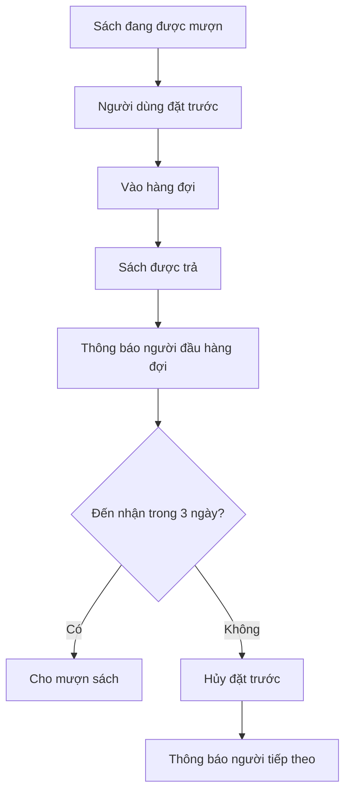

# Quy định Nghiệp vụ

## Tổng quan

Tài liệu này mô tả các quy định nghiệp vụ cốt lõi của hệ thống quản lý thư viện, bao gồm thời hạn mượn, giới hạn, phí phạt và các chính sách liên quan.

## 1. Thời hạn mượn sách

### Quy định mặc định

| Loại người dùng | Thời hạn mượn | Có thể cấu hình |
|-----------------|---------------|-----------------|
| Học sinh | 30 ngày | ✅ |
| Giáo viên | 60 ngày | ✅ |
| Thủ thư | 30 ngày | ✅ |

### Cấu hình theo loại sách

Hệ thống cho phép cấu hình thời hạn mượn khác nhau theo loại sách:

#### Sách tham khảo

- **Thời hạn**: 7 ngày
- **Lý do**: Sách có nhu cầu cao, nhiều người cần sử dụng
- **Ví dụ**: Từ điển, bách khoa toàn thư, sách ôn thi

#### Sách giáo khoa

- **Thời hạn**: 90 ngày (cả học kỳ)
- **Lý do**: Học sinh cần sử dụng xuyên suốt học kỳ
- **Ví dụ**: SGK Toán 10, SGK Văn 11

#### Sách thường

- **Thời hạn**: 30 ngày (mặc định)
- **Lý do**: Cân bằng giữa nhu cầu đọc và luân chuyển sách
- **Ví dụ**: Tiểu thuyết, sách kỹ năng, sách khoa học

#### Tạp chí/Báo

- **Thời hạn**: 3 ngày
- **Lý do**: Nội dung có tính thời sự, cần luân chuyển nhanh
- **Ví dụ**: Tạp chí khoa học, báo tuần

### Cách tính thời hạn

- **Ngày bắt đầu**: Ngày mượn sách (không tính giờ)
- **Ngày kết thúc**: Ngày mượn + số ngày cho phép
- **Ngày nghỉ**: Thứ 7, Chủ nhật và ngày lễ **KHÔNG** được tính vào thời hạn
- **Ví dụ**: 
  - Mượn ngày 01/05 (Thứ 2), thời hạn 7 ngày
  - Hạn trả: 08/05 (Thứ 2) - bỏ qua 04-05/05 (cuối tuần)

### Cấu hình đặc biệt

Admin có thể cấu hình:

- Thời hạn mượn theo từng đầu sách cụ thể
- Thời hạn mượn theo thể loại
- Thời hạn mượn theo vai trò người dùng
- Có/không tính ngày nghỉ vào thời hạn

---

## 2. Giới hạn mượn sách

### Số lượng sách được mượn cùng lúc

| Loại người dùng | Giới hạn mặc định | Có thể cấu hình |
|-----------------|-------------------|-----------------|
| Học sinh | 5 cuốn | ✅ |
| Giáo viên | 10 cuốn | ✅ |
| Thủ thư | 5 cuốn | ✅ |

### Giới hạn theo loại sách

Có thể cấu hình giới hạn riêng cho từng loại sách:

- **Sách tham khảo**: Tối đa 2 cuốn/người
- **Tạp chí**: Tối đa 3 cuốn/người
- **Sách thường**: Không giới hạn (trong tổng số cho phép)

### Điều kiện mượn sách

Người dùng **KHÔNG** được mượn sách nếu:

1. Đã đạt giới hạn số sách được mượn
2. Có sách quá hạn chưa trả
3. Có nợ phạt > 100,000đ (học sinh) hoặc > 500,000đ (giáo viên)
4. Tài khoản bị khóa
5. Sách đó đang được người dùng mượn (không mượn trùng)

### Ưu tiên mượn

Khi sách có sẵn và có nhiều người đặt trước:

1. **Giáo viên** (ưu tiên cao nhất)
2. **Học sinh** (theo thứ tự đặt trước)
3. **Thủ thư** (ưu tiên thấp nhất)

---

## 3. Gia hạn sách

### Quy định chung

- **Số lần gia hạn**: Không giới hạn
- **Điều kiện**: Không có ai đặt trước sách đó
- **Thời gian gia hạn**: Bằng thời hạn mượn ban đầu
- **Cách tính**: Từ ngày gia hạn (không phải từ ngày hết hạn cũ)

### Ví dụ

```
Mượn sách: 01/05/2026
Hạn trả: 31/05/2026 (30 ngày)
Gia hạn: 25/05/2026
Hạn trả mới: 24/06/2026 (30 ngày từ 25/05)
```

### Giới hạn gia hạn

| Loại người dùng | Số lần gia hạn | Điều kiện đặc biệt |
|-----------------|----------------|-------------------|
| Học sinh | Không giới hạn | Không ai đặt trước |
| Giáo viên | Không giới hạn | Không ai đặt trước |
| Thủ thư | Không giới hạn | Không ai đặt trước |

### Không được gia hạn khi

1. Có người đặt trước sách
2. Sách đã quá hạn
3. Sách bị đánh dấu cần thu hồi
4. Người dùng có nợ phạt quá hạn mức

### Gia hạn tự động

Hệ thống có thể cấu hình gia hạn tự động:

- **Điều kiện**: Không ai đặt trước, sắp hết hạn (3 ngày)
- **Thông báo**: Gửi email/thông báo cho người dùng
- **Giới hạn**: Tối đa 2 lần gia hạn tự động

---

## 4. Phí phạt

### Phạt trả muộn

#### Quy định mặc định

| Loại người dùng | Phí phạt/ngày | Có thể cấu hình |
|-----------------|---------------|-----------------|
| Học sinh | 5,000đ | ✅ |
| Giáo viên | 0đ (chỉ nhắc nhở) | ✅ |
| Thủ thư | 5,000đ | ✅ |

#### Cách tính phí phạt

```
Phí phạt = Số ngày quá hạn × Phí phạt/ngày
```

**Ví dụ**:
- Hạn trả: 31/05/2026
- Ngày trả: 05/06/2026
- Số ngày quá hạn: 5 ngày
- Phí phạt: 5 × 5,000đ = 25,000đ

#### Phạt lũy tiến

Có thể cấu hình phạt tăng dần theo thời gian:

| Số ngày quá hạn | Phí phạt/ngày |
|-----------------|---------------|
| 1-7 ngày | 5,000đ |
| 8-30 ngày | 10,000đ |
| > 30 ngày | 20,000đ |

#### Phí phạt tối đa

- **Giới hạn**: Không vượt quá giá trị sách
- **Ví dụ**: Sách giá 100,000đ → phạt tối đa 100,000đ

### Phạt đặc biệt cho Giáo viên

Giáo viên **KHÔNG** bị phạt tiền khi trả muộn, nhưng:

1. Nhận email nhắc nhở khi quá hạn
2. Nhận cảnh báo sau 30 ngày quá hạn
3. Tài khoản bị khóa sau 180 ngày quá hạn
4. Vẫn phải bồi thường nếu làm mất/hỏng sách

### Miễn giảm phạt

#### Quyền miễn giảm

| Vai trò | Mức miễn giảm | Điều kiện |
|---------|---------------|-----------|
| Thủ thư | Tối đa 50% | Có lý do hợp lý |
| Admin | Không giới hạn | Có lý do và ghi chú |

#### Lý do miễn giảm hợp lệ

- Ốm đau, nhập viện (có giấy xác nhận)
- Sự cố gia đình
- Lỗi hệ thống
- Sách bị lỗi không đọc được
- Trường hợp bất khả kháng

#### Quy trình miễn giảm

1. Người dùng nộp đơn xin miễn giảm + chứng từ
2. Thủ thư xem xét và phê duyệt (nếu ≤ 50%)
3. Admin phê duyệt (nếu > 50%)
4. Ghi log lý do miễn giảm

---

## 5. Đặt trước sách

### Quy định chung

- **Số người đặt trước**: Chỉ 1 người/sách tại một thời điểm
- **Thời gian giữ chỗ**: 3 ngày kể từ khi sách có sẵn
- **Thông báo**: Email/SMS khi sách sẵn sàng
- **Hủy tự động**: Sau 3 ngày không đến nhận

### Quy trình đặt trước



### Hàng đợi đặt trước

- **Thứ tự**: FIFO (First In First Out)
- **Ưu tiên**: Giáo viên > Học sinh > Thủ thư
- **Xem hàng đợi**: Người dùng thấy vị trí của mình
- **Hủy đặt trước**: Người dùng có thể hủy bất kỳ lúc nào

### Giới hạn đặt trước

| Loại người dùng | Số sách đặt trước tối đa |
|-----------------|--------------------------|
| Học sinh | 3 cuốn |
| Giáo viên | 5 cuốn |
| Thủ thư | 3 cuốn |

### Không được đặt trước khi

1. Đã đạt giới hạn đặt trước
2. Có sách quá hạn chưa trả
3. Tài khoản bị khóa
4. Đang mượn sách đó (không đặt trước sách mình đang mượn)

---

## 6. Bồi thường sách

### Trường hợp phải bồi thường

1. **Làm mất sách**: Bồi thường 100% giá sách
2. **Làm hỏng nặng**: Bồi thường 80% giá sách
3. **Làm hỏng nhẹ**: Bồi thường 30% giá sách
4. **Làm ướt/rách**: Bồi thường 50% giá sách

### Định nghĩa mức độ hỏng

#### Hỏng nhẹ

- Gấp góc trang
- Viết chú thích nhỏ bằng bút chì
- Bìa bị trầy xước nhẹ
- **Xử lý**: Phạt 30% giá sách, sách vẫn lưu thông

#### Hỏng nặng

- Rách nhiều trang
- Viết, vẽ bằng bút mực
- Bìa rời, gáy sách gãy
- Ướt, mốc, mất trang
- **Xử lý**: Phạt 80% giá sách, sách loại bỏ

#### Mất sách

- Không tìm thấy sách
- Mất hoàn toàn
- **Xử lý**: Phạt 100% giá sách + phí xử lý 20,000đ

### Giá sách tính bồi thường

- **Ưu tiên**: Giá mua ghi trong hệ thống
- **Nếu không có**: Giá thị trường hiện tại
- **Sách cũ**: Giảm 10%/năm, tối thiểu 30% giá gốc

### Thay thế bằng sách mới

Người dùng có thể thay thế bằng sách mới cùng đầu:

- **Điều kiện**: Sách mới, nguyên vẹn, cùng phiên bản hoặc mới hơn
- **Miễn phí**: Không phải đóng tiền bồi thường
- **Phí xử lý**: Vẫn phải đóng 20,000đ

### Quy trình bồi thường

1. Thủ thư đánh giá mức độ hỏng
2. Tính toán số tiền bồi thường
3. Người dùng thanh toán hoặc thay thế sách
4. Cập nhật trạng thái sách trong hệ thống
5. Ghi log bồi thường

---

## 7. Khóa tài khoản

### Lý do khóa tự động

| Lý do | Điều kiện | Mở khóa |
|-------|-----------|---------|
| Quá hạn lâu | > 90 ngày (học sinh) | Trả sách + đóng phạt |
| Quá hạn lâu | > 180 ngày (giáo viên) | Trả sách |
| Nợ phạt cao | > 500,000đ | Thanh toán đủ |
| Vi phạm nhiều | > 5 lần/tháng | Admin xem xét |
| Làm mất sách | Chưa bồi thường | Bồi thường xong |

### Khóa thủ công

Admin/Thủ thư có thể khóa tài khoản với lý do:

- Vi phạm nội quy thư viện
- Hành vi không phù hợp
- Yêu cầu từ nhà trường
- Tài khoản không còn sử dụng

### Ảnh hưởng khi bị khóa

- Không thể mượn sách mới
- Không thể đặt trước sách
- Không thể gia hạn sách
- Vẫn phải trả sách đang mượn
- Vẫn phải thanh toán phạt

### Mở khóa tài khoản

1. Giải quyết lý do bị khóa
2. Liên hệ thủ thư/admin
3. Xác nhận đã khắc phục
4. Thủ thư/admin mở khóa

---

## 8. Cấu hình hệ thống

### Tham số có thể cấu hình

| Tham số | Mặc định | Đơn vị |
|---------|----------|--------|
| Thời hạn mượn (học sinh) | 30 | ngày |
| Thời hạn mượn (giáo viên) | 60 | ngày |
| Giới hạn mượn (học sinh) | 5 | cuốn |
| Giới hạn mượn (giáo viên) | 10 | cuốn |
| Phí phạt/ngày (học sinh) | 5,000 | đồng |
| Phí phạt/ngày (giáo viên) | 0 | đồng |
| Thời gian giữ chỗ đặt trước | 3 | ngày |
| Giới hạn đặt trước | 3 | cuốn |
| Ngưỡng khóa tài khoản (nợ) | 500,000 | đồng |
| Ngưỡng khóa tài khoản (quá hạn) | 90 | ngày |
| Số ngày nhắc trước hạn trả | 3 | ngày |
| Phí xử lý mất sách | 20,000 | đồng |

### Cấu hình theo loại sách

Admin có thể tạo quy định riêng cho từng loại sách:

- Thời hạn mượn khác nhau
- Giới hạn số lượng khác nhau
- Phí phạt khác nhau
- Cho phép/không cho phép đặt trước

### Cấu hình theo thời gian

Có thể cấu hình quy định khác nhau theo:

- **Học kỳ**: Nới lỏng trong hè, nghiêm ngặt trong kỳ thi
- **Sự kiện**: Ưu đãi trong tuần lễ sách
- **Ngày lễ**: Tự động gia hạn qua kỳ nghỉ dài

---

## 9. Thông báo tự động

### Loại thông báo

| Sự kiện | Thời điểm | Kênh |
|---------|-----------|------|
| Sắp hết hạn | 3 ngày trước | Email + App |
| Quá hạn | Ngày quá hạn | Email + SMS |
| Sách đặt trước có sẵn | Khi sách được trả | Email + SMS |
| Hết hạn giữ chỗ | 1 ngày trước hết hạn | Email + App |
| Có phạt mới | Khi phát sinh | Email |
| Tài khoản bị khóa | Khi khóa | Email + SMS |

### Tần suất nhắc nhở

- **Sắp hết hạn**: 1 lần (3 ngày trước)
- **Quá hạn**: Mỗi 7 ngày
- **Đặt trước sẵn sàng**: 1 lần, nhắc lại sau 2 ngày
- **Nợ phạt**: Mỗi 14 ngày

### Tùy chọn người dùng

Người dùng có thể:

- Bật/tắt từng loại thông báo
- Chọn kênh nhận thông báo
- Cấu hình thời gian nhận (không nhận ban đêm)

---

## Tóm tắt

| Quy định | Học sinh | Giáo viên | Ghi chú |
|----------|----------|-----------|---------|
| **Thời hạn mượn** | 30 ngày | 60 ngày | Có thể cấu hình |
| **Giới hạn mượn** | 5 cuốn | 10 cuốn | Cùng lúc |
| **Gia hạn** | Không giới hạn | Không giới hạn | Nếu không ai đặt trước |
| **Phí phạt/ngày** | 5,000đ | 0đ | Giáo viên chỉ nhắc nhở |
| **Đặt trước** | 3 cuốn | 5 cuốn | Giữ chỗ 3 ngày |
| **Bồi thường mất** | 100% giá | 100% giá | + phí xử lý 20,000đ |
| **Khóa tài khoản** | > 90 ngày quá hạn | > 180 ngày quá hạn | Hoặc nợ > 500,000đ |
